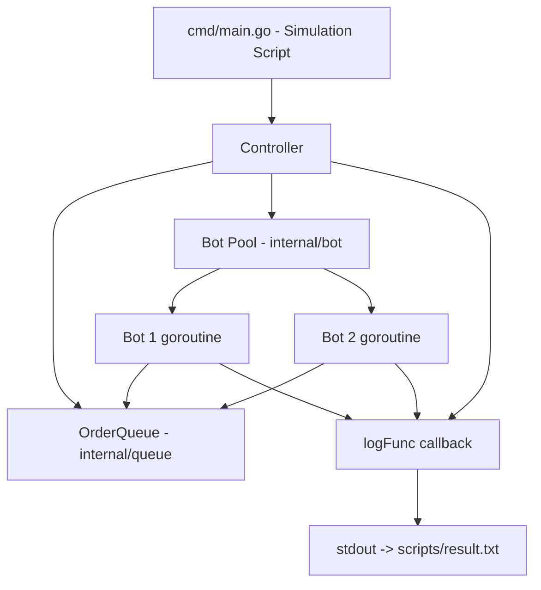

## Product Overview

A Go (Golang) CLI application that simulates McDonald's automated cooking bot order management system. The application runs a predefined simulation scenario demonstrating all required features, and outputs timestamped results to `scripts/result.txt`.

## Core Features

- **Order Management**: Support creating Normal and VIP orders with unique auto-incrementing IDs (starting from #1001). Normal orders append to the PENDING queue. VIP orders are inserted ahead of all Normal orders but behind existing VIP orders.
- **Bot Management**: Bots can be added and removed dynamically. Each bot processes one order at a time, taking 10 seconds per order. Adding a bot starts processing immediately if orders are pending. Removing a bot destroys the newest one; if it was processing an order, that order returns to the front of the PENDING queue.
- **Idle Bot Behavior**: When no orders are pending, bots become IDLE and automatically pick up new orders as they arrive.
- **Timestamped Output**: All actions are logged with `[HH:MM:SS]` timestamps and written to `scripts/result.txt`, including a "Final Status" summary at the end.
- **CI Compatibility**: Must compile and run in GitHub Actions (Go 1.23.9, ubuntu-latest) via `scripts/test.sh`, `scripts/build.sh`, and `scripts/run.sh`. CI verifies result.txt exists, is non-empty, and contains `HH:MM:SS` timestamps.

## Tech Stack

- **Language**: Go 1.23.9
- **Concurrency**: goroutines + sync.Mutex for thread-safe queue access, channels for bot signaling
- **Testing**: Go standard `testing` package
- **Build**: `go build` producing a single binary
- **No external dependencies**: Pure standard library

## Implementation Approach

The application is a CLI that runs a hardcoded simulation scenario demonstrating all user stories. The architecture is intentionally lean — 3 internal packages plus the main entry point — following the README's guidance to avoid over-engineering.

**Core Components**:

1. **OrderQueue** (`internal/queue`): A thread-safe priority queue (slice-based) with VIP-before-Normal ordering. VIP orders are inserted after existing VIP orders but before Normal orders. O(n) insertion, perfectly fine for this scale.

2. **Bot** (`internal/bot`): Each bot runs as a goroutine. It listens for work via a buffered notification channel. When notified, it dequeues an order, processes it for `ProcessingTime` (default 10s), logs completion, then loops. Context-based cancellation enables clean shutdown when removed.

3. **Controller** (`internal/controller`): Orchestrates the system. Manages bot slice, shared order queue, and a log function. Exposes `NewNormalOrder()`, `NewVIPOrder()`, `AddBot()`, `RemoveBot()` methods. Logging is handled by a simple `logFunc` callback (a `func(format string, args ...any)`) — no separate logger package needed.

4. **main.go** (`cmd/main.go`): Entry point that creates a Controller with a log function writing to stdout, runs a scripted simulation sequence with `time.Sleep` delays, then prints the final summary.

**Key Technical Decisions**:

- **Inline logging via callback**: Instead of a separate `logger` package, the Controller accepts a `logFunc` parameter. This function prepends `[HH:MM:SS]` timestamps and writes to an `io.Writer`. This is simpler, avoids an extra package, and is equally testable.
- **Configurable `ProcessingTime`**: A package-level variable in the `bot` package (default 10s) allows tests to use a shorter duration (e.g., 100ms).
- **Context-based cancellation for bots**: `context.WithCancel` per bot. When cancelled mid-processing, the bot returns the order to the front of the queue.
- **Mutex over channels for queue**: Shared data structure with mutex is simpler and more idiomatic for this use case.
- **Order IDs starting at 1001**: Matches the sample `result.txt` format.

## Implementation Notes

- **Bot removal edge case**: When removing the newest bot while it's processing, cancel its context and wait for the bot goroutine to confirm (via `done` channel) it has returned the order before proceeding. This prevents race conditions.
- **Idle bot notification**: Buffered channel (capacity 1) per bot. Non-blocking send when new orders arrive prevents deadlocks.
- **CI workflow**: The `backend-verify-result.yaml` only checks that `scripts/result.txt` exists, is non-empty, and contains `HH:MM:SS` pattern via grep. It does NOT validate specific content. Scripts must run from the repo root directory.
- **Script paths**: `run.sh` must write output to `scripts/result.txt` (relative to repo root). The binary should be built as `order-controller` in the project root.
- **Test scope**: Focus on queue priority ordering and controller integration. Keep tests minimal but meaningful — 2 test files max.

## Architecture Design



### Data Flow

1. `main()` creates a Controller with a timestamp-prepending log function, then calls `NewNormalOrder()` / `NewVIPOrder()` / `AddBot()` / `RemoveBot()` in a timed sequence
2. Controller enqueues orders to OrderQueue, notifies idle bots via their channels
3. Bot goroutines dequeue orders, sleep for `ProcessingTime`, invoke the log function on completion, then loop
4. `run.sh` redirects stdout to `scripts/result.txt`

## Directory Structure

```
se-take-home-assignment/
├── go.mod                        # [NEW] Go module: module github.com/dnisting/se-take-home-assignment, go 1.23.9
├── .gitignore                    # [NEW] Ignore compiled binary (order-controller), IDE files (.idea, .vscode)
├── cmd/
│   └── main.go                   # [NEW] Entry point. Creates a Controller with a log function that writes timestamped lines to os.Stdout. Runs a hardcoded simulation: create 3 orders (Normal, VIP, Normal), add 2 bots, wait for processing, create another VIP order, remove a bot, wait, print "Final Status" summary. Matches sample result.txt scenario.
├── internal/
│   ├── queue/
│   │   ├── queue.go              # [NEW] Order struct (ID int, Type string "Normal"/"VIP", Status string "PENDING"/"PROCESSING"/"COMPLETE"). OrderQueue struct with sync.Mutex, []Order slice. Methods: Enqueue(order) with VIP priority insertion, EnqueueFront(order) for returning cancelled orders, Dequeue() returns pointer or nil, Len() int, PendingOrders() for status display.
│   │   └── queue_test.go         # [NEW] Unit tests: Normal FIFO ordering, VIP priority insertion (ahead of Normal, behind existing VIP), EnqueueFront puts order at position 0, Dequeue from empty returns nil, mixed VIP/Normal scenarios.
│   ├── bot/
│   │   └── bot.go                # [NEW] ProcessingTime var (10s default). Bot struct: ID, queue pointer, logFunc callback, context/cancel, notify channel (buffered 1), current order pointer, mutex, done channel. Start() launches goroutine loop. Stop() cancels context, waits on done channel. Goroutine: wait on notify or context -> dequeue -> set status PROCESSING -> sleep ProcessingTime -> set status COMPLETE -> log -> loop.
│   └── controller/
│       ├── controller.go         # [NEW] Controller struct: mutex, queue, bots slice, logFunc, nextOrderID (starts 1001), nextBotID (starts 1). NewNormalOrder()/NewVIPOrder() create order, enqueue, log, notify idle bots. AddBot() creates bot, starts it, logs. RemoveBot() removes newest bot, stops it, logs. GetStatus() returns summary stats for final output.
│       └── controller_test.go    # [NEW] Integration tests with short ProcessingTime (100ms): test order creation increments IDs, test VIP priority via queue state, test bot processes and completes order, test bot removal returns order to pending. Minimal but covers core logic.
├── scripts/
│   ├── build.sh                  # [MODIFY] Replace placeholder: set -e, cd to script dir parent, go build -o order-controller ./cmd/
│   ├── run.sh                    # [MODIFY] Replace placeholder: set -e, cd to script dir parent, ./order-controller > scripts/result.txt
│   ├── test.sh                   # [MODIFY] Replace placeholder: set -e, cd to script dir parent, go test ./... -v
│   └── result.txt                # [MODIFY] Will be overwritten by run.sh execution output
```

## Key Code Structures

```
// internal/queue/queue.go — Order doubles as the data model (no separate models package)
type Order struct {
    ID     int
    Type   string // "Normal" or "VIP"
    Status string // "PENDING", "PROCESSING", "COMPLETE"
}

type OrderQueue struct {
    mu     sync.Mutex
    orders []*Order
}

func (q *OrderQueue) Enqueue(o *Order)        // VIP priority insertion
func (q *OrderQueue) EnqueueFront(o *Order)    // Return cancelled order to front
func (q *OrderQueue) Dequeue() *Order          // Returns nil if empty
func (q *OrderQueue) Len() int
```

```
// internal/bot/bot.go
var ProcessingTime = 10 * time.Second

type Bot struct {
    ID      int
    queue   *queue.OrderQueue
    logFunc func(string, ...any)
    ctx     context.Context
    cancel  context.CancelFunc
    notify  chan struct{}
    current *queue.Order
    mu      sync.Mutex
    done    chan struct{}
}

func NewBot(id int, q *queue.OrderQueue, logFunc func(string, ...any)) *Bot
func (b *Bot) Start()
func (b *Bot) Stop() *queue.Order // returns in-progress order if any
```

```
// internal/controller/controller.go
type Controller struct {
    mu          sync.Mutex
    queue       *queue.OrderQueue
    bots        []*bot.Bot
    logFunc     func(string, ...any)
    nextOrderID int // starts at 1001
    nextBotID   int // starts at 1
}

func New(logFunc func(string, ...any)) *Controller
func (c *Controller) NewNormalOrder()
func (c *Controller) NewVIPOrder()
func (c *Controller) AddBot()
func (c *Controller) RemoveBot()
```

## Agent Extensions

### MCP

- **gomcp**
- Purpose: Use `start_process` to compile the Go application (`go build`), run tests (`go test ./... -v`), and execute the simulation (`./order-controller`). Use `kill_process` to clean up any hanging processes.
- Expected outcome: Verify the application compiles without errors, all unit/integration tests pass, and `scripts/result.txt` is produced with correct timestamped output matching the expected format.

### SubAgent

- **code-explorer**
- Purpose: Explore the codebase during implementation to verify file paths, import paths, and cross-file consistency.
- Expected outcome: Accurate module references and import paths across all Go files.