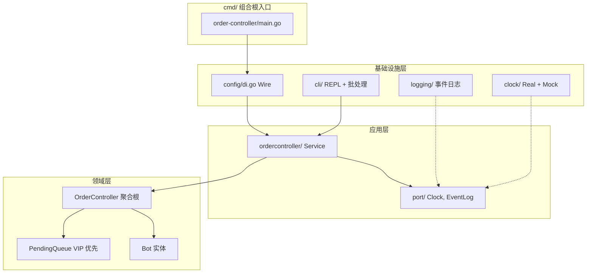

# McDonald's 订单控制器（Order Controller）

> 面向 McDonald's 烹饪机器人的内存订单编排 CLI — VIP 优先队列、Bot 动态伸缩、带时间戳的事件日志。

本项目是 McDonald's **订单控制器** 的 Take-Home 作业实现：一个 Go 后端 CLI，负责在烹饪 Bot 之间调度顾客订单（含 VIP 优先）、支持运行时增减 Bot，并输出适用于 CI 校验的结构化日志。

基于 **Go 1.23.9**（仅标准库），采用 **领域驱动设计（DDD）** 与 **六边形架构（Hexagonal Architecture）**。

---

## 概述

COVID-19 期间，McDonald's 探索烹饪机器人自动化以降低人力、提升出餐效率。订单控制器作为编排层，负责：

1. 接收 **普通（Normal）** 与 **VIP** 订单并加入待处理队列
2. 调度空闲 Bot 处理订单（默认每单 10 秒）
3. 将已完成订单移入完成列表
4. 支持店长动态增减 Bot 数量

本项目实现作业的 **Backend CLI** 路径。全部状态保存在内存中，无持久化、无第三方依赖。

---

## 功能特性

| 功能 | 行为 |
|------|------|
| **普通订单** | 在普通队列内 FIFO；排在所有 VIP 订单之后 |
| **VIP 订单** | 优先于所有普通订单；VIP 段内 FIFO |
| **烹饪 Bot** | 每个 Bot 同时只处理 1 单；处理时长可配置（默认 10s） |
| **增加 Bot（`+bot`）** | 创建新 Bot，并立即从队首取下一单 |
| **减少 Bot（`-bot`）** | 移除**最新**创建的 Bot（LIFO）；若正在处理则中断，并按原 `pickupIndex` 回插队列 |
| **事件日志** | 所有操作输出到 stdout，前缀为 `HH:MM:SS` 时间戳 |
| **交互式 REPL** | 供演示与面试使用的实时命令行 |
| **批处理模式** | 脚本驱动，用于 CI 与可复现场景 |

---

## 架构

代码库遵循 **DDD + 六边形（Ports & Adapters）** 分层：领域层保持纯业务规则；应用层编排定时器与日志；基础设施层适配 I/O 与时钟。



```
cmd/
└── order-controller/main.go      # CLI 入口（组合根）

internal/
├── domain/ordercontroller/       # 聚合根、实体、队列规则
│   ├── aggregate.go              # OrderController — 下单、管理 Bot
│   ├── pending_queue.go          # VIP 优先双段 FIFO 队列
│   ├── bot.go                    # Bot 状态机（IDLE / PROCESSING）
│   └── order.go                  # Order 实体（Normal / VIP）
├── application/
│   ├── port/                     # Clock、EventLog、TimerHandle 接口
│   └── ordercontroller/          # 应用服务 — 调度 + 定时器
└── infrastructure/
    ├── config/di.go              # 依赖装配（Wire）
    ├── cli/                      # REPL、批处理文件、stdin 运行器
    ├── clock/                    # 真实时钟 + 测试用 Mock 时钟
    └── logging/                  # EventLogger → stdout
```

**依赖规则：** domain ← application ← infrastructure。领域层不依赖任何外层包。

---

## 环境要求

- **Go 1.23.9** — [安装 Go](https://go.dev/doc/install)
- **Bash** — 运行辅助脚本（`scripts/*.sh`）

无需第三方 Go 模块。

---

## 快速开始

```bash
# 克隆并进入仓库
git clone https://github.com/lijian-bj/se-take-home-assignment.git
cd se-take-home-assignment

# 运行测试、编译并执行 CI 场景
./scripts/test.sh
./scripts/build.sh
./scripts/run.sh

# 查看输出（时间戳格式 HH:MM:SS）
cat scripts/result.txt
```

预期输出示例：

```
15:35:49 SYSTEM started
15:35:49 ORDER created id=1 type=NORMAL pending=[1]
15:35:49 ORDER created id=2 type=VIP pending=[2,1]
15:35:49 BOT created id=1
15:35:49 BOT id=1 picked order id=2 pickupIndex=0
...
15:35:49 STATUS bots=1:IDLE,2:IDLE pending=[] complete=[1,2]
```

---

## 使用说明

### 编译

```bash
./scripts/build.sh
# 产物：bin/order-controller
```

或手动编译：

```bash
go build -o bin/order-controller ./cmd/order-controller
```

### CLI 参数

| 参数 | 默认值 | 说明 |
|------|--------|------|
| `--batch <path>` | — | 从脚本文件执行命令（以 `#` 开头的行会被忽略） |
| `--interactive` | `false` | 启动交互式 REPL，提示符为 `>` |
| `--process-duration` | `10s` | 每个 Bot 处理一单所需的时长 |

### 运行模式

**批处理文件** — CI 使用：

```bash
./bin/order-controller --batch scripts/scenarios/ci.txt --process-duration=100ms
```

**交互式 REPL** — 现场演示：

```bash
./bin/order-controller --interactive
```

**Stdin 批处理** — 未指定参数时的默认模式；可通过管道传入命令：

```bash
echo -e "normal\nvip\n+bot\nstatus\nquit" | ./bin/order-controller --process-duration=1s
```

### 交互式命令

| 命令 | 别名 | 说明 |
|------|------|------|
| `normal` | `n` | 创建普通订单 |
| `vip` | `v` | 创建 VIP 订单（排在所有普通订单之前） |
| `+bot` | `addbot` | 增加 Bot；若有待处理订单则立即取单 |
| `-bot` | `removebot` | 移除最新 Bot；中断中的订单按原位置回插 |
| `status` | `s` | 打印 Bot、待处理队列、已完成订单快照 |
| `wait <duration>` | — | 阻塞直到全部 Bot 空闲或超时（如 `wait 5s`、`wait 300ms`） |
| `quit` | `q` | 退出 REPL |

> [!TIP]
> 开发与 CI 时可使用较短的 `--process-duration`（如 `100ms`）以加快场景执行。作业规范中每单处理时长为 10 秒，用于模拟真实出餐时间。

### 示例会话

```bash
$ ./bin/order-controller --interactive --process-duration=2s
> normal
15:04:01 ORDER created id=1 type=NORMAL pending=[1]
> vip
15:04:05 ORDER created id=2 type=VIP pending=[2,1]
> +bot
15:04:08 BOT created id=1
15:04:08 BOT id=1 picked order id=2 pickupIndex=0
> status
15:04:10 STATUS bots=1:PROCESSING:2 pending=[1] complete=[]
> wait 5s
15:04:10 BOT id=1 completed order id=2 complete=[2]
15:04:10 BOT id=1 idle
> quit
```

### 事件日志格式

所有事件写入 stdout，并带时间戳前缀：

| 事件 | 示例 |
|------|------|
| 系统启动 | `HH:MM:SS SYSTEM started` |
| 订单创建 | `HH:MM:SS ORDER created id=1 type=VIP pending=[2,1]` |
| Bot 创建 | `HH:MM:SS BOT created id=1` |
| Bot 取单 | `HH:MM:SS BOT id=1 picked order id=2 pickupIndex=0` |
| Bot 完成 | `HH:MM:SS BOT id=1 completed order id=2 complete=[1,2]` |
| Bot 空闲 | `HH:MM:SS BOT id=1 idle` |
| Bot 中断 | `HH:MM:SS BOT id=1 interrupted order id=3 reinserted at index=1 pending=[...]` |
| Bot 移除 | `HH:MM:SS BOT removed id=2` |
| 状态快照 | `HH:MM:SS STATUS bots=1:IDLE pending=[3] complete=[1,2]` |

---

## 项目结构

```
.
├── cmd/order-controller/           # CLI 入口（组合根）
├── internal/
│   ├── domain/ordercontroller/   # 纯领域逻辑
│   ├── application/                # 用例 + 端口接口
│   └── infrastructure/             # CLI、时钟、日志、DI
├── scripts/
│   ├── test.sh                     # go test ./... -race
│   ├── build.sh                    # 编译 bin/order-controller
│   ├── run.sh                      # CI 批处理场景 → scripts/result.txt
│   ├── scenarios/ci.txt            # CI 输入脚本
│   └── result.txt                  # 生成产物（已 gitignore，由 run.sh 创建）
├── docs/
│   ├── PRD.md                      # 产品需求文档
│   ├── ORD.md                      # 原始作业说明
│   ├── test-report.md              # 测试报告
│   ├── performance-report.md       # 性能报告
│   └── superpowers/specs/          # 技术设计文档
└── .github/workflows/
    └── backend-verify-result.yaml  # PR CI 流水线
```

---

## 测试

运行完整测试套件（含竞态检测）：

```bash
./scripts/test.sh
```

等价命令：

```bash
go test ./... -race -count=1
```

测试覆盖：领域层队列规则（VIP 优先、`pickupIndex` 回插）、CLI 解析、应用层调度、Mock 时钟行为。

---

## CI

向 `main` 提交的 Pull Request 会触发 **backend-verify-result** GitHub Actions 工作流：

1. 校验 Go 1.23.9（工作流模板中亦包含 Node.js/npm 校验）
2. 执行 `./scripts/test.sh`
3. 执行 `./scripts/build.sh`
4. 执行 `./scripts/run.sh` — 将带时间戳的输出写入 `scripts/result.txt`
5. 断言 `scripts/result.txt` 存在、非空，且包含 `HH:MM:SS` 格式时间戳

CI 运行脚本使用较短的处理时长：

```bash
ORDER_PROCESS_DURATION=100ms ./scripts/run.sh
```

> [!NOTE]
> 提交 PR 前请确保 `backend-verify-result` 检查通过。

---

## 文档

| 文档 | 说明 |
|------|------|
| [docs/PRD.md](docs/PRD.md) | 产品需求 — 用户故事、队列规则、Bot 生命周期 |
| [docs/ORD.md](docs/ORD.md) | FeedMe 原始 Take-Home 作业说明 |
| [docs/test-report.md](docs/test-report.md) | 单元测试覆盖率与结果 |
| [docs/performance-report.md](docs/performance-report.md) | 性能分析 |
| [docs/superpowers/specs/2026-07-06-order-controller-backend-design.md](docs/superpowers/specs/2026-07-06-order-controller-backend-design.md) | 后端技术设计文档 |

---

## 设计要点

**VIP 优先队列** — 待处理订单分为 `VIP` 与 `Normal` 两个 FIFO 段。出队时始终优先 VIP；段内保持先进先出。

**Bot 移除（LIFO）** — 减少 Bot 时移除最近创建的一个。若该 Bot 正在处理订单，则按原 `pickupIndex` 回插待处理队列，保持相对优先级不变。

**六边形边界** — `port.Clock` 与 `port.EventLog` 接口使测试可注入 Mock 时钟与丢弃日志，无需修改领域层或应用层代码。

**三种 CLI 模式** — CI 批处理、面试交互 REPL、stdin 脚本模式共用同一命令解析器与应用服务。
