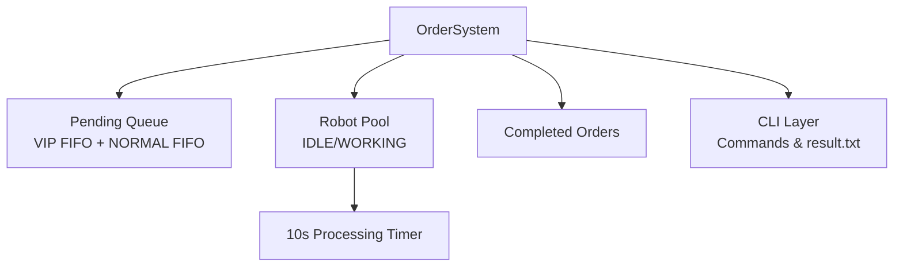

# McDonald's Automated Order Controller (Node.js CLI)

A clean, deterministic, fully testable Node.js backend implementation of the FeedMe take‑home assignment.  
This project simulates an automated McDonald's kitchen with:

- Priority‑based order scheduling  
- VIP preemption  
- Robot worker pool  
- Order rollback  
- Deterministic 10‑second processing  
- CLI interaction  
- Automated result export  
- Full test coverage  
- GitHub Actions CI

This repository is designed to be **production‑quality**, **interview‑ready**, and **fully aligned with the official assignment requirements**.

---

## ✨ Core Features

### 🟡 Order Management
- Create **NORMAL** and **VIP** orders  
- Globally increasing order IDs  
- VIP‑first priority queue  
- FIFO inside VIP and NORMAL groups  
- Deterministic timestamps (`HH:MM:SS`)

### 🔴 VIP Preemption
- VIP orders **interrupt robots processing NORMAL orders**
- Interrupted NORMAL orders are **rolled back** into the pending queue  
- Queue order is preserved using `vipSeq` / `normalSeq`

### 🤖 Robot Management
- Add robots (immediately dispatch orders)
- Remove robots (LIFO)
- If a robot is removed while working:
  - Its order is rolled back
  - Timer is cancelled safely

### ⏱️ Deterministic Processing
- Each order takes **10 seconds**
- Uses injectable timers for deterministic testing

### 📄 Output
- On exit, system writes `result.txt`:
  ```
  Order <id> completed at <HH:MM:SS>
  ```
- Sorted by actual completion time

### 🧪 Testing
- Pure Node.js test runner (`node --test`)
- Fake timers for deterministic behavior
- Covers:
  - Queue ordering
  - VIP preemption
  - Robot lifecycle
  - Rollback correctness

---

## 🏗️ Architecture Overview



For full architecture details, see:  
📄 [docs/architecture.md](docs/architecture.md)

---

## 📁 Project Structure

```
src/
  orderSystem.js     # Core scheduling engine
  cli.js             # Interactive CLI
script/
  build.sh
  test.sh
  run.sh
  run-demo.sh
tests/
  orderSystem.test.js
docs/
  business-spec.md
  user-stories.md
  architecture.md
  sequence-diagram.md
  testing.md
result.txt            # Generated on exit
```

---

## 🧭 CLI Commands

| Command          | Description                                   |
| ---------------- | --------------------------------------------- |
| `add normal`     | Create a normal order                         |
| `add vip`        | Create a VIP order                            |
| `add robot`      | Add a robot                                   |
| `remove robot`   | Remove the newest robot (rollback if working) |
| `list pending`   | Show pending orders                           |
| `list completed` | Show completed orders                         |
| `state`          | Show full system state                        |
| `help`           | Show command list                             |
| `exit`           | Write `result.txt` and quit                   |

---

## 🚀 Running the Project

### Build
```bash
./script/build.sh
```

### Run tests
```bash
./script/test.sh
```

### Interactive CLI
```bash
./script/run.sh
```

Or directly:

```bash
node src/cli.js
```

### Demo mode (auto‑run)
```bash
./script/run-demo.sh
```

---

## 🧪 Testing

This project uses **pure Node.js test runner** (`node --test`) with **fake timers** for deterministic behavior.

Run tests:

```bash
npm test
```

Covers:

- VIP FIFO ordering  
- Robot processing lifecycle  
- Correct rollback ordering  
- Preemption correctness  
- Deterministic timestamps  

Full testing documentation:  
📄 [docs/testing.md](docs/testing.md)

---

## 📚 Documentation

| Document                                             | Description                                 |
| ---------------------------------------------------- | ------------------------------------------- |
| [docs/business-spec.md](docs/business-spec.md)       | Full business specification                 |
| [docs/user-stories.md](docs/user-stories.md)         | Complete user stories & acceptance criteria |
| [docs/architecture.md](docs/architecture.md)         | Architecture design & rationale             |
| [docs/sequence-diagram.md](docs/sequence-diagram.md) | Key system sequence diagrams                |
| [docs/testing.md](docs/testing.md)                   | Testing strategy & key test cases           |

---

## ✔️ Assignment Compliance

This implementation satisfies **all** FeedMe take‑home requirements:

- Priority queue with VIP preemption  
- Robot add/remove with rollback  
- Deterministic 10‑second processing  
- CLI with required commands  
- result.txt output  
- Automated CI  
- Full test coverage  
- Clean, readable, maintainable code  
- Professional documentation  

---

## 📜 License

MIT License.
