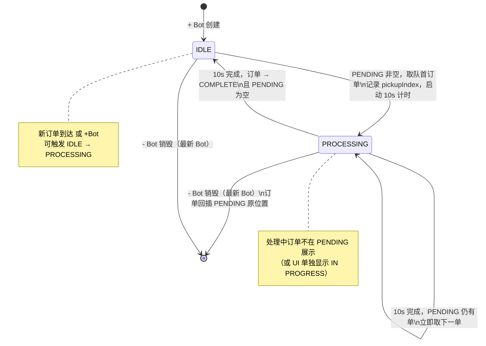

# PRD：McDonald's 订单控制器（Order Controller）

---

## 1. 文档信息

| 字段 | 内容 |
|------|------|
| **文档名称** | McDonald's 订单控制器 — 产品需求文档 |
| **版本** | v1.0 |
| **状态** | Draft（草稿，待评审） |
| **作者** | [待填写 — 候选人姓名] |
| **评审人** | [待填写 — 面试官 / Tech Lead] |
| **创建日期** | 2026-07-06 |
| **最后更新** | 2026-07-06 |
| **关联文档** | `ORD.md`（原始作业说明） |
| **实现路径** | **Backend（Go CLI）** — 已确认 |

---

## 2. 背景与目标

### 2.1 背景

COVID-19 期间，McDonald's 加速推进门店自动化，引入 **烹饪机器人（Cooking Bot）** 替代部分人工，以降低成本、提升出餐效率。订单控制器（Order Controller）是这一系统的核心编排层，负责：

- 接收顾客订单（普通 / VIP）
- 维护待处理队列（PENDING）
- 调度空闲 Bot 取单、烹饪（10 秒/单）
- 将完成订单移入 COMPLETE 区域
- 支持店长动态增减 Bot 数量

本 PRD 面向 **Take-Home Assignment** 原型实现，强调功能完整性与可演示性，而非生产级可靠性。

### 2.2 产品目标

| 目标 | 说明 |
|------|------|
| **G1：完整演示订单生命周期** | 用户可观察订单从创建 → PENDING → 处理中 → COMPLETE 的全流程 |
| **G2：正确实现 VIP 优先调度** | VIP 订单始终优先于普通订单，同级 FIFO |
| **G3：支持 Bot 动态伸缩** | 增 Bot 立即消费 PENDING；减 Bot 中断处理并将订单安全回队 |
| **G4：可验证、可测试** | 前端可公开访问演示；后端可通过 CI（`backend-verify-result`）自动校验 |

### 2.3 非目标（本阶段）

- 支付、库存、配送、会员体系集成
- 数据持久化
- 多门店 / 分布式部署

---

## 3. 用户角色与画像

### 3.1 普通顾客（Normal Customer）

- **画像**：到店或通过 App 下单的普通用户，无优先权
- **诉求**：提交订单后能在 PENDING 看到自己的单号；完成后在 COMPLETE 看到
- **痛点**：若 VIP 插队导致等待过长，需有清晰队列可视化（前端）或日志（后端）

### 3.2 VIP 会员（VIP Member）

- **画像**：付费会员或高价值客户，享有出餐优先权
- **诉求**：订单在**所有普通订单之前**处理；若已有 VIP 订单，则排在后者之后（VIP 内部 FIFO）
- **约束**：不能插队到更早 VIP 订单之前

### 3.3 店长 / 经理（Manager）

- **画像**：门店运营负责人，负责根据客流调整 Bot 数量
- **诉求**：
  - `+ Bot`：新增 Bot 并**立即**开始处理 PENDING 订单
  - `- Bot`：移除最新 Bot；若该 Bot 正在处理，订单须**中断并回到 PENDING 原位置**（保持 VIP/Normal 优先级）
- **权限**：本原型中 Manager 即系统操作者，无需登录鉴权

### 3.4 烹饪机器人（Cooking Bot）

- **画像**：自动化执行单元，非人类用户，作为系统 Actor
- **行为约束**：
  - 同一时刻仅处理 **1** 个订单
  - 每单固定耗时 **10 秒**
  - 完成后自动取下一单；无 PENDING 时进入 **IDLE**

---

## 4. 用户故事（含验收标准）

### Story 1：普通顾客下单与追踪

> **As a** 普通顾客，**I want to** 提交订单并在 PENDING / COMPLETE 区域看到状态变化，**so that** 我了解出餐进度。

**验收标准：**

| # | Given | When | Then |
|---|-------|------|------|
| S1-AC1 | 系统初始为空 | 点击「New Normal Order」 | PENDING 出现新订单，类型为 Normal，订单号唯一且递增 |
| S1-AC2 | 订单 #N 在 PENDING，有 Bot 空闲 | Bot 开始处理 #N | #N 从 PENDING 移除（或标记为处理中，见 UI 设计决策） |
| S1-AC3 | 订单 #N 已被 Bot 处理满 10 秒 | 处理完成 | #N 出现在 COMPLETE，且不在 PENDING |
| S1-AC4 | 多个普通订单按 #1、#2、#3 顺序创建 | 仅 1 个 Bot 工作 | 完成顺序为 #1 → #2 → #3（FIFO） |

---

### Story 2：VIP 会员优先排队

> **As a** VIP 会员，**I want to** 我的订单优先于所有普通订单，**so that** 我更快拿到餐品。

**验收标准：**

| # | Given | When | Then |
|---|-------|------|------|
| S2-AC1 | PENDING 有 Normal #1、#2 | 创建 VIP #3 | PENDING 顺序为 VIP #3 → Normal #1 → Normal #2 |
| S2-AC2 | PENDING 有 VIP #1、Normal #2 | 创建 VIP #3 | PENDING 顺序为 VIP #1 → VIP #3 → Normal #2 |
| S2-AC3 | PENDING 仅有 Normal 订单 | 创建 VIP 订单 | VIP 订单排在所有 Normal 之前 |
| S2-AC4 | VIP #1 正在处理，PENDING 有 Normal #2、VIP #3 | VIP #1 完成 | 下一单为 VIP #3（非 Normal #2） |

---

### Story 3：店长增减 Bot

> **As a** 店长，**I want to** 动态调整 Bot 数量，**so that** 匹配当前订单负载。

**验收标准：**

| # | Given | When | Then |
|---|-------|------|------|
| S3-AC1 | PENDING 有订单，无 Bot 或 Bot 均 IDLE | 点击「+ Bot」 | 新 Bot 创建并**立即**取 PENDING 队首订单开始处理 |
| S3-AC2 | 已有 2 个 Bot 在处理 | 点击「+ Bot」 | 第 3 个 Bot 创建；若 PENDING 仍有订单，立即取单 |
| S3-AC3 | 3 个 Bot，Bot #3（最新）正在处理 #5 | 点击「- Bot」 | Bot #3 被销毁；#5 中断并回到 PENDING **原位置**（见 §7.4） |
| S3-AC4 | 3 个 Bot 均 IDLE | 点击「- Bot」 | 最新 Bot 被移除，其余 Bot 不受影响 |
| S3-AC5 | 仅 0 个 Bot | 点击「- Bot」 | 无 Bot 可删；系统给出明确反馈（无操作 / 提示信息） |

---

### Story 4：Bot 处理行为

> **As a** 烹饪 Bot，**I want to** 按规则取单并计时，**so that** 订单准确完成。

**验收标准：**

| # | Given | When | Then |
|---|-------|------|------|
| S4-AC1 | Bot IDLE，PENDING 非空 | Bot 取单 | 开始 10 秒倒计时/计时 |
| S4-AC2 | Bot 处理中 | 10 秒到达 | 订单移入 COMPLETE；Bot 若 PENDING 仍有单则立即取下一单，否则 IDLE |
| S4-AC3 | Bot IDLE，PENDING 为空 | 等待 | Bot 保持 IDLE，不消耗 CPU 轮询（后端可用事件驱动） |
| S4-AC4 | 新订单到达，有 IDLE Bot | 订单入 PENDING | IDLE Bot **立即**（或下一调度周期内）取单 |

---

## 5. 功能需求（FR-xxx）

| ID | 需求描述 | 优先级 | 适用路径 |
|----|----------|--------|----------|
| **FR-001** | 提供「New Normal Order」操作，创建 Normal 类型订单并加入 PENDING 队尾（Normal 段末尾） | P0 | Frontend + Backend |
| **FR-002** | 提供「New VIP Order」操作，创建 VIP 订单并插入 PENDING：位于所有 Normal 之前、所有已有 VIP 之后 | P0 | Frontend + Backend |
| **FR-003** | 订单号全局唯一、严格单调递增；**建议从 1 开始**，每次创建 +1，不因 Bot 移除或回队而重用 | P0 | Frontend + Backend |
| **FR-004** | 提供「+ Bot」操作，创建新 Bot；若 PENDING 非空且该 Bot 空闲，立即取队首订单并开始 10 秒处理 | P0 | Frontend + Backend |
| **FR-005** | 提供「- Bot」操作，销毁**最新创建**的 Bot（LIFO 删除策略） | P0 | Frontend + Backend |
| **FR-006** | Bot 处理完成后，订单移入 COMPLETE；Bot 继续处理 PENDING 下一单或转 IDLE | P0 | Frontend + Backend |
| **FR-007** | PENDING 为空时，Bot 处于 IDLE，不处理任何订单 | P0 | Frontend + Backend |
| **FR-008** | Bot 被 `- Bot` 中断时，当前订单回插 PENDING **原位置**（见 §7.4 算法） | P0 | Frontend + Backend |
| **FR-009** | UI 展示 PENDING、COMPLETE 两个（或三个含 PROCESSING）区域及当前 Bot 列表/状态 | P0 | **Frontend only** |
| **FR-010** | CLI 将运行结果输出至 `scripts/result.txt`，每行或关键事件含 `HH:MM:SS` 时间戳 | P0 | **Backend only** |
| **FR-011** | 提供 `scripts/test.sh`、`scripts/build.sh`、`scripts/run.sh` 可执行脚本 | P0 | **Backend only** |
| **FR-012** | 支持交互式 CLI 命令输入（面试演示用），非仅硬编码脚本 | P1 | **Backend only** |
| **FR-013** | 前端部署至公网可访问 URL | P0 | **Frontend only** |
| **FR-014** | 展示每个 Bot 的 ID、状态（IDLE / PROCESSING / 当前订单号） | P1 | Frontend（推荐）/ Backend（日志） |
| **FR-015** | 新订单到达时，若有 IDLE Bot，自动触发取单（无需再次点击 + Bot） | P0 | Frontend + Backend |

> **注**：仓库中脚本目录为 `scripts/`（非作业原文 `script/`），以实现与 CI 一致为准。

---

## 6. 非功能需求

| ID | 类别 | 要求 |
|----|------|------|
| **NFR-001** | 存储 | 全内存，进程重启后状态丢失，可接受 |
| **NFR-002** | 性能 | 原型规模（<100 订单、<10 Bot）下 UI 响应 <200ms；CLI 单命令响应即时 |
| **NFR-003** | 时间精度 | 订单处理时长 = **10 秒**（允许 ±100ms 系统误差）；Backend 日志时间戳格式 `HH:MM:SS`（24 小时制，补零，如 `09:05:03`） |
| **NFR-004** | 可测试性 | Backend 核心队列/Bot 逻辑须有单元测试；`scripts/test.sh` 在 CI 中必须通过 |
| **NFR-005** | 可维护性 | 代码清晰、模块分离（队列、Bot 调度、CLI/UI 层）；避免过度工程 |
| **NFR-006** | 兼容性 | Backend：Go 1.23.9 或 Node.js 22.19.0（与 CI workflow 一致） |
| **NFR-007** | 部署 | Frontend：任意公开托管（Vercel / Netlify / GitHub Pages 等） |
| **NFR-008** | 版本控制 | Backend 须走 GitHub Flow，PR 触发 `backend-verify-result` 并通过 |

---

## 7. 业务规则与优先级队列逻辑

### 7.1 核心数据结构（概念模型）

```
Order {
  id: int           // 全局递增，从 1 开始
  type: NORMAL | VIP
  createdAt: timestamp (optional, for logging)
}

PendingQueue {
  vipSegment:   [Order]   // FIFO
  normalSegment: [Order]  // FIFO
}

CompleteList: [Order]     // 按完成顺序追加

Bot {
  id: int           // 创建顺序递增，从 1 开始
  state: IDLE | PROCESSING
  currentOrder: Order | null
  processingStartedAt: timestamp | null
  pickupIndex: int | null   // 取单时在 PendingQueue 中的逻辑位置（用于回插）
}
```

**逻辑队首** = `vipSegment[0]`（若存在），否则 `normalSegment[0]`。

### 7.2 入队规则

| 操作 | 算法 |
|------|------|
| **New Normal Order** | `id = nextOrderId++`；`normalSegment.append(order)` |
| **New VIP Order** | `id = nextOrderId++`；`vipSegment.append(order)` |

**示例：**

初始：`[]`

1. Normal #1 → `[N1]`
2. Normal #2 → `[N1, N2]`
3. VIP #3 → `[V3, N1, N2]`
4. VIP #4 → `[V3, V4, N1, N2]`
5. Normal #5 → `[V3, V4, N1, N2, N5]`

### 7.3 出队（Bot 取单）

```
function dequeueNext():
  if vipSegment not empty:
    order = vipSegment.pop_front()
  else if normalSegment not empty:
    order = normalSegment.pop_front()
  else:
    return null
  return order
```

**取单时记录 `pickupIndex`**：在**完整逻辑队列**中的 0-based 索引（VIP 段在前），供 `- Bot` 回插使用。

### 7.4 回插规则（Bot 被移除且正在处理）

当 Bot 被 `- Bot` 销毁且 `currentOrder != null`：

1. 停止该 Bot 的 10 秒计时器
2. 将 `currentOrder` 回插 PENDING，位置 = **`pickupIndex` 所记录的原逻辑位置**
3. 回插时仍须满足：所有 VIP 在 Normal 之前

**推荐算法（精确原位置）：**

```
function reinsert(order, pickupIndex):
  logical = flatten(vipSegment, normalSegment)
  logical.insert(pickupIndex, order)
  vipSegment, normalSegment = split_by_type(logical)
```

**若 `pickupIndex` 未记录**，退化为按类型回插（不推荐，无法保证精确相对位置）。

### 7.5 多 Bot 并发调度

| 规则 | 说明 |
|------|------|
| **并发度** | 每个 Bot 独立处理 1 单；N 个 Bot 最多同时处理 N 单 |
| **取单竞争** | 多个 IDLE Bot 同时可用时，按 **Bot id 升序**（先创建的优先取单） |
| **队首定义** | 所有 Bot 共享同一 PENDING 队列，始终从逻辑队首取单 |
| **完成顺序** | 取决于 Bot 数量与取单时间，**不要求** COMPLETE 列表按订单 id 排序 |

**示例：2 Bot，PENDING `[V1, N2, N3]`**

- Bot1 取 V1，Bot2 取 N2（并发）
- 10s 后两者几乎同时完成 → COMPLETE 顺序取决于谁先完成计时

### 7.6 新订单触发 IDLE Bot

```
onOrderCreated(order):
  enqueue(order)
  for bot in bots sorted by id:
    if bot.state == IDLE:
      assignNextOrder(bot)
      break
```

**`+ Bot` 时**：新 Bot 创建后**立即**尝试 `assignNextOrder(新Bot)`。

---

## 8. Bot 生命周期状态机



### 状态定义

| 状态 | 含义 | 允许转换 |
|------|------|----------|
| **IDLE** | 空闲，未绑定订单 | → PROCESSING（有 PENDING 且被调度） |
| **PROCESSING** | 正在烹饪，绑定 1 个订单，计时进行中 | → IDLE / PROCESSING（完成）/ 销毁（- Bot） |

### Bot 创建与销毁顺序

- **创建顺序**：Bot id 单调递增（1, 2, 3…）
- **销毁策略**：`- Bot` 移除 **id 最大（最新创建）** 的 Bot
- **销毁优先级**：若最新 Bot 为 PROCESSING，先中断回队再销毁；若为 IDLE，直接销毁

---

## 9. 边界情况与异常场景

| # | 场景 | 期望行为 |
|---|------|----------|
| **EC-001** | PENDING 为空时点击「New Order」 | 正常创建；若有 IDLE Bot，立即取单 |
| **EC-002** | 无 Bot 时创建订单 | 订单留在 PENDING，等待 `+ Bot` |
| **EC-003** | Bot 数量为 0 时 `- Bot` | 无操作，输出提示（不 crash） |
| **EC-004** | 仅 1 个 Bot 处理中，`- Bot` | 订单回插原位置；系统无 Bot |
| **EC-005** | 多 Bot 并发处理，`- Bot` 目标为最新且 IDLE | 仅移除该 Bot，其他 Bot 不受影响 |
| **EC-006** | 多 Bot 并发，最新 Bot PROCESSING，`- Bot` | 中断并回插；其他 Bot 继续处理各自订单 |
| **EC-007** | 处理中 `- Bot` 后，回插订单位于队首 | 下一调度由 IDLE Bot 按规则取队首（可能是回插单） |
| **EC-008** | VIP 处理中被 `- Bot` 回插，期间新 VIP 入队 | 回插到 **原 pickupIndex**；新 VIP 可能在回插单之前或之后，取决于 index |
| **EC-009** | 连续快速点击「New Order」 | 订单 id 连续递增，无重复；队列顺序正确 |
| **EC-010** | 连续快速 `+ Bot` | 每个新 Bot 若 PENDING 有单则立即取单；不重复取同一单 |
| **EC-011** | 10 秒计时期间 `- Bot` | 计时取消，**不会** 将半完成订单写入 COMPLETE |
| **EC-012** | 所有 Bot PROCESSING，PENDING 为空，新订单到达 | 订单入 PENDING，**不**打断正在处理的 Bot；处理完成后某 Bot 会取到新单 |
| **EC-013** | 订单 id 起始点 | **从 1 开始**；重启后重置为 1（无持久化） |
| **EC-014** | 时间戳跨午夜 | Backend 日志仍用 `HH:MM:SS`；不强制日期部分 |
| **EC-015** | Frontend 刷新页面 | 状态丢失（符合 NFR-001）；可接受 |

---

## 10. UI / CLI 交互规格

### 10.1 Frontend 路径（**适用：Frontend**）

#### 布局建议

```
┌─────────────────────────────────────────────────────┐
│  McDonald's Order Controller                        │
├─────────────────────────────────────────────────────┤
│  [ New Normal Order ]  [ New VIP Order ]            │
│  [ + Bot ]  [ - Bot ]                               │
├─────────────────────────────────────────────────────┤
│  BOTS (N)                                           │
│  Bot #1: PROCESSING — Order #3 (7s remaining)       │
│  Bot #2: IDLE                                       │
├─────────────────────────────────────────────────────┤
│  PENDING (3)                                        │
│  VIP #4 | VIP #5 | Normal #6                      │
├─────────────────────────────────────────────────────┤
│  COMPLETE (2)                                       │
│  #1 ✓ | #2 ✓                                        │
└─────────────────────────────────────────────────────┘
```

#### 交互要求

| 元素 | 行为 |
|------|------|
| New Normal / VIP Order | 即时更新 PENDING，触发 IDLE Bot 取单 |
| + Bot / - Bot | 即时更新 Bot 列表与队列 |
| PENDING | 按 §7 顺序展示；处理中订单可隐藏或灰显（需统一） |
| COMPLETE | 按完成时间追加展示 |
| 倒计时 | 可选 P1：显示剩余秒数，增强可演示性 |

#### 部署

- 编译并部署至公网 URL
- README 中提供访问链接

---

### 10.2 Backend 路径（**适用：Backend**）

#### 目录结构

```
scripts/
  test.sh      # 单元测试
  build.sh     # 编译
  run.sh       # 运行 CLI，输出 → scripts/result.txt
  result.txt   # CI 校验产物
```

#### CI 校验流程（`backend-verify-result`）

1. 安装 Go 1.23.9、Node.js 22.19.0
2. `chmod +x scripts/test.sh scripts/build.sh scripts/run.sh`
3. `./scripts/test.sh` 成功
4. `./scripts/build.sh` 成功
5. `./scripts/run.sh` 成功
6. `scripts/result.txt` 存在、非空、含 `[0-9]{2}:[0-9]{2}:[0-9]{2}` 格式时间戳

#### CLI 命令建议（交互式，P1 面试必备）

| 命令 | 别名 | 说明 |
|------|------|------|
| `normal` / `n` | New Normal Order | 创建普通订单 |
| `vip` / `v` | New VIP Order | 创建 VIP 订单 |
| `+bot` / `addbot` | + Bot | 新增 Bot |
| `-bot` / `removebot` | - Bot | 移除最新 Bot |
| `status` / `s` | — | 打印当前状态 |
| `quit` / `q` | — | 退出 |

#### `result.txt` 输出格式（**Backend**）

- **必须**包含至少一处 `HH:MM:SS` 格式时间戳
- **推荐**每行一条事件日志：

```
09:00:00 SYSTEM started
09:00:01 ORDER created id=1 type=NORMAL pending=[1]
09:00:02 BOT created id=1
09:00:02 BOT id=1 picked order id=1
09:00:12 BOT id=1 completed order id=1 complete=[1]
09:00:12 BOT id=1 idle
```

- `run.sh` 可运行**预设场景脚本**（非交互）以满足 CI；交互模式用于本地/面试

---

## 11. 验收标准（Given-When-Then 测试场景）

### 11.1 基础流程

**TC-001 单 Bot 单单**

- **Given** 系统为空
- **When** 创建 Normal #1 → +Bot → 等待 10s
- **Then** COMPLETE 含 #1，PENDING 为空，Bot IDLE

**TC-002 VIP 插队**

- **Given** PENDING 有 Normal #1
- **When** 创建 VIP #2 → +Bot
- **Then** Bot 先处理 #2，完成后处理 #1

**TC-003 双 VIP FIFO**

- **Given** PENDING 有 VIP #1
- **When** 创建 VIP #2
- **Then** 处理顺序为 #1 → #2

### 11.2 Bot 管理

**TC-004 增 Bot 立即消费**

- **Given** PENDING 有 #1、#2，无 Bot
- **When** +Bot
- **Then** Bot 立即处理 #1

**TC-005 减 Bot（IDLE）**

- **Given** 2 个 Bot 均 IDLE
- **When** -Bot
- **Then** 剩余 1 个 Bot（id 较小者）

**TC-006 减 Bot（PROCESSING 回插）**

- **Given** 1 Bot 处理 #3（自 PENDING `[V3, N1, N2]` 取走 V3），已处理 4s
- **When** -Bot
- **Then** #3 回到 PENDING 队首 `[V3, N1, N2]`，无 Bot，COMPLETE 无 #3

**TC-007 减 Bot 后重新处理**

- **Given** TC-006 之后
- **When** +Bot
- **Then** Bot 从队首取 #3，10s 后 COMPLETE 含 #3

### 11.3 多 Bot 并发

**TC-008 双 Bot 并发取单**

- **Given** PENDING `[V1, N2, N3]`，无 Bot
- **When** +Bot → +Bot
- **Then** Bot1 处理 V1，Bot2 处理 N2；N3 仍在 PENDING

**TC-009 减最新 Bot 不影响其他**

- **Given** Bot1 处理 #1，Bot2 处理 #2
- **When** -Bot（移除 Bot2）
- **Then** #2 回插原位置；Bot1 继续 #1

### 11.4 订单编号

**TC-010 订单 id 递增**

- **Given** 已创建 #1、#2
- **When** 创建 VIP #3
- **Then** id=3，且此前 id 不重用

**TC-011 起始 id**

- **Given** 全新进程
- **When** 首个订单创建
- **Then** id = **1**

### 11.5 Backend 专项

**TC-012 CI 产物**

- **Given** Backend 实现完成
- **When** 运行 `./scripts/run.sh`
- **Then** `scripts/result.txt` 非空且含 `HH:MM:SS`

---

## 12. 不在范围内（Out of Scope）

| 项目 | 说明 |
|------|------|
| 数据库 / 持久化 | 内存-only |
| 用户认证 / 角色权限 | Manager 即操作者 |
| 真实烹饪设备集成 | 模拟 10s 延迟即可 |
| 订单位置变更（取消、改单） | 未在需求中 |
| 订单超时、失败重试 | 未要求 |
| 多门店、路由、负载均衡 | 单店原型 |
| 国际化 | 英文 UI 即可 |
| 移动端原生 App | Web 或 CLI 足够 |
| 同时实现 Frontend + Backend | 作业要求 **二选一** |

---

## 13. 成功指标

| 指标 | 目标 | 测量方式 |
|------|------|----------|
| **功能完整度** | 100% P0 FR 通过 | §11 测试场景全部通过 |
| **VIP 正确性** | 0 次 VIP 晚于 Normal 出队（同队列状态下） | 单元测试 + 手动场景 |
| **Bot 回插正确性** | `- Bot` 后 PENDING 顺序与 pickupIndex 一致 | 专项测试 TC-006/009 |
| **Backend CI** | `backend-verify-result` 绿色 | GitHub Actions |
| **Frontend 可访问** | 公网 URL 可打开并操作 | 面试官访问验证 |
| **代码质量** | 核心逻辑有测试，结构清晰 | Code Review |
| **交付时效** | ~1 工作小时内可演示原型 | 团队自评 |

---

## 14. 风险与依赖

| 风险 | 影响 | 缓解措施 |
|------|------|----------|
| **「原位置」语义歧义** | 回插逻辑实现错误 | 采用 §7.4 `pickupIndex` 方案；开放问题确认 |
| **多 IDLE Bot 唤醒策略歧义** | 并发行为与预期不符 | 文档化 chosen behavior；测试覆盖 |
| **10s 计时与 CI** | CI 等待过长 | `run.sh` 用加速时钟 / mock time（测试层） |
| **Frontend 部署失败** | 无法演示 | 提前验证部署流水线 |
| **目录名 scripts vs script** | 路径错误导致 CI 失败 | 以仓库 `scripts/` 为准 |
| **过度工程** | 超时交付 | 优先 P0，P1 按需 |
| **面试交互 CLI 未准备** | 二面演示受阻 | Backend 路径预留交互入口 |

### 依赖

- GitHub Actions 环境：Go 1.23.9、Node 22.19.0
- 候选人自选：Frontend 框架 / Backend 语言（Go 或 Node.js）

---

## 15. 开放问题（待澄清）

| ID | 问题 | 建议默认 | 影响 |
|----|------|----------|------|
| **OQ-001** | 「原位置」是否指取单瞬间的精确索引，还是仅 VIP/Normal 段内位置？ | **取单瞬间逻辑队列索引** | §7.4 回插算法 |
| **OQ-002** | PENDING 展示是否包含「正在处理」的订单？ | **不包含**；可选 IN PROGRESS 区 | UI 布局 |
| **OQ-003** | 新订单到达时，唤醒所有 IDLE Bot 还是仅一个？ | **仅唤醒一个**（最小 bot id）；`+Bot` 时新 Bot 自己取单 | 并发调度 |
| **OQ-004** | COMPLETE 列表按完成时间还是订单 id 排序？ | **按完成时间追加** | 展示顺序 |
| **OQ-005** | 订单 id / Bot id 是否都从 1 开始？ | **是** | 测试基准 |
| **OQ-006** | 时间戳用 UTC 还是本地时区？ | **本地时区**（开发机/CI 服务器） | 日志一致性 |
| **OQ-007** | `run.sh` 用固定脚本还是 stdin 管道？ | **固定场景** 满足 CI；交互模式本地运行 | CI vs 面试 |
| **OQ-008** | 处理中 `- Bot` 后，10s 部分进度是否保留？ | **不保留**；重新处理满 10s | 计时逻辑 |
| **OQ-009** | 多个 Bot 同时完成时，result.txt 时间戳相同如何处理？ | 允许相同 `HH:MM:SS`；可加毫秒（P1，非 CI 必须） | 日志精度 |
| **OQ-010** | Frontend 是否需要模拟真实 10s 等待？ | **是**；可加速模式作为 P1 开发便利 | UX |

---

## 附录 A：实现路径决策矩阵

| 维度 | Frontend | Backend |
|------|----------|---------|
| 可视化 | 强 | 弱（靠日志） |
| CI 自动化 | 无内置 | 有 `backend-verify-result` |
| 面试演示 | 直观 | 交互 CLI 考察编码能力 |
| 时间投入 | 中（含部署） | 中（含测试脚本） |
| 建议人群 | 偏全栈 / 重视 UX | 偏 Go/Node 后端 |

---

## 附录 B：术语表

| 术语 | 定义 |
|------|------|
| **PENDING** | 待处理队列，含 VIP 段与 Normal 段 |
| **COMPLETE** | 已完成订单列表 |
| **IDLE** | Bot 空闲，未绑定订单 |
| **PROCESSING** | Bot 正在处理某订单（10s 计时中） |
| **pickupIndex** | Bot 取单时订单在逻辑 PENDING 队列中的索引，用于 `- Bot` 回插 |

---

*文档结束 — v1.0 Draft*
