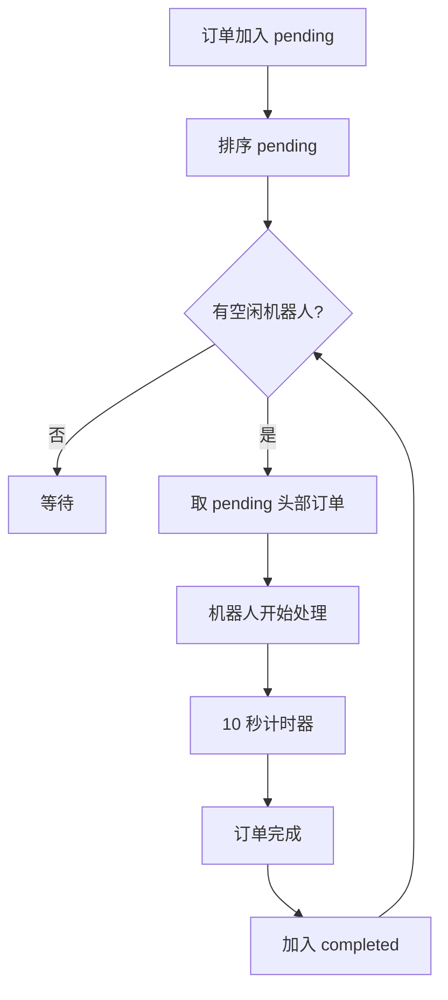
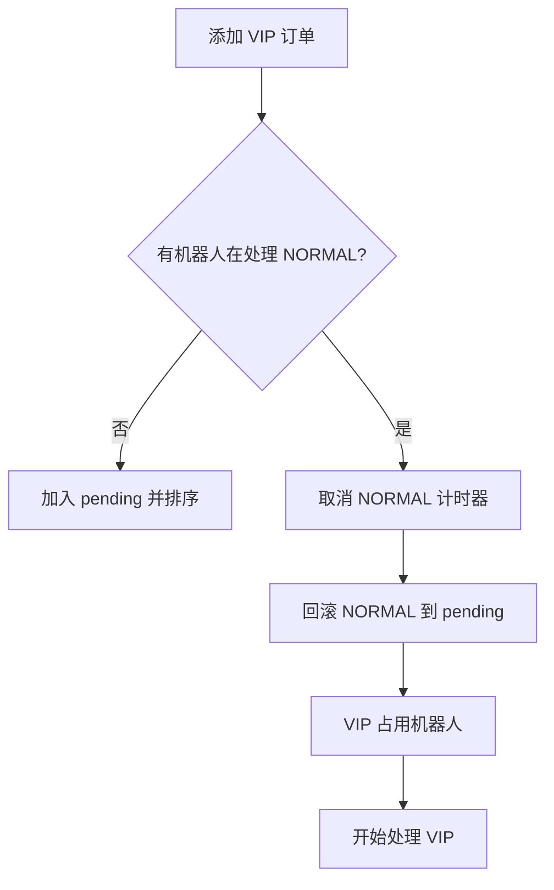

# 麦当劳自动化烹饪机器人订单控制系统 – 业务方案

本方案完全基于当前仓库中的 `OrderSystem.js` 实现，确保文档与代码行为完全一致。


## 1. 项目背景

麦当劳正在推进自动化厨房，通过烹饪机器人替代人工制作部分食品。本项目实现一个 **订单调度控制系统**，用于模拟：

- 顾客下单（普通 / VIP）
- 机器人并发处理订单
- VIP 抢占普通订单
- 机器人动态增减
- 回滚订单
- 订单完成记录（含时间戳）
- CLI 输出 result.txt

系统为 **内存系统**，无持久化。


## 2. 系统目标

- 实现一个可运行的订单调度系统
- 满足所有业务规则（VIP 优先、FIFO、抢占、回滚）
- 提供 CLI 交互
- 提供 result.txt 输出
- 通过 GitHub Actions 自动验证


## 3. 系统架构

系统由三个核心模块组成：

```
+---------------------+
|    OrderSystem      |
| pending[]           |
| completed[]         |
| robots[]            |
| nextOrderId         |
| nextRobotId         |
+---------------------+
          |
          | manages
          v
+---------------------+
|   Robot Workers     |
|  (IDLE / WORKING)   |
+---------------------+
          |
          | process
          v
+---------------------+
|      Orders         |
| (VIP / NORMAL FIFO) |
+---------------------+
```


## 4. 领域模型

### 4.1 Order

| 字段            | 类型                                    | 说明                     |
| --------------- | --------------------------------------- | ------------------------ |
| id              | number                                  | 全局递增 ID              |
| type            | `'VIP'` / `'NORMAL'`                    | 订单类型                 |
| status          | `'PENDING'` / `'PROCESSING'` / `'DONE'` | 当前状态                 |
| createdAt       | string                                  | ISO 时间戳               |
| completedAt     | string                                  | HH:MM:SS                 |
| completedAtMs   | number                                  | 完成时间毫秒，用于排序   |
| vipSeq          | number \| null                          | VIP 组内序号（用于排序） |
| normalSeq       | number \| null                          | 普通组内序号（用于排序） |
| assignedRobotId | number \| null                          | 当前处理机器人           |
| timer           | any                                     | setTimeout 句柄          |

### 4.2 Robot

| 字段           | 类型                   | 说明            |
| -------------- | ---------------------- | --------------- |
| id             | number                 | 自增 ID         |
| status         | `'IDLE'` / `'WORKING'` | 当前状态        |
| currentOrderId | number \| null         | 正在处理的订单  |
| currentOrder   | Order \| null          | 引用订单对象    |
| timer          | any                    | setTimeout 句柄 |


## 5. 核心业务规则（与代码完全一致）

### 5.1 订单优先级与排序

系统维护一个 `pending[]` 队列，排序规则：

1. 所有 VIP 在前  
2. 所有 NORMAL 在后  
3. VIP 内部按 `vipSeq` 升序（FIFO）  
4. NORMAL 内部按 `normalSeq` 升序（FIFO）  

代码对应：`#sortPending()`


### 5.2 VIP 抢占 NORMAL（Preemption）

当添加 VIP 订单时：

- 若有机器人正在处理 NORMAL 订单  
- 则立即中断该 NORMAL 订单  
- NORMAL 订单回滚到 `pending` 队列（保持 FIFO 顺序）  
- VIP 订单立即占用该机器人开始处理  

代码对应：

```js
if (t === 'VIP') {
  const workingNormalRobot = this.robots.find(
    (r) => r.status === 'WORKING' && r.currentOrder?.type === 'NORMAL'
  );
  // ... 抢占逻辑
}
```


### 5.3 回滚逻辑

当 NORMAL 订单被抢占或机器人被删除时：

- 取消该订单的计时器
- 订单状态恢复为 `PENDING`
- `assignedRobotId` 置为 `null`
- 订单重新插入 `pending` 队列
- 重新排序（VIP FIFO + NORMAL FIFO）

代码对应：

```js
prevOrder.status = 'PENDING';
this.pending.push(prevOrder);
this.#sortPending();
```


### 5.4 机器人调度

调度触发时机：

- 新订单加入
- 机器人空闲
- 订单完成
- 回滚订单加入 `pending`

调度规则：

- 遍历所有机器人
- 若机器人状态为 `IDLE` 且 `pending` 非空
- 分配 `pending.shift()` 给该机器人

代码对应：`#dispatch()`


### 5.5 订单完成

- 订单处理时间为 **10 秒**
- 完成后状态变为 `DONE`
- 记录完成时间 `HH:MM:SS`
- 推入 `completed[]` 数组
- 机器人状态变为 `IDLE`
- 再次触发 `#dispatch()`

代码对应：`#startProcessing()`


## 6. 流程图

### 6.1 订单调度流程



### 6.2 VIP 抢占流程




## 7. CLI 交互与输出规范

系统提供命令行交互界面，支持以下命令：

- `add <type>` — 添加订单，`type` 为 `VIP` 或 `NORMAL`
- `remove <robotId>` — 移除指定机器人（LIFO 删除，若工作中则回滚其订单）
- `addRobot` — 新增一个空闲机器人
- `exit` — 退出程序，并生成 `result.txt`

退出时按订单完成时间升序输出：

```
Order <id> completed at <HH:MM:SS>
```

代码对应：`writeResult()`


## 8. 验收标准

- [x] VIP 永远优先于 NORMAL  
- [x] FIFO 顺序正确  
- [x] VIP 抢占 NORMAL 正常  
- [x] 回滚 NORMAL 正常  
- [x] 机器人 LIFO 删除（删除时若工作中则回滚订单）  
- [x] 订单完成时间正确  
- [x] result.txt 正确生成  
- [x] CI 全部通过  


## 9. 文档与代码一致性声明

本方案完全基于当前仓库中的 `OrderSystem.js`，所有描述均与实际行为一致。
