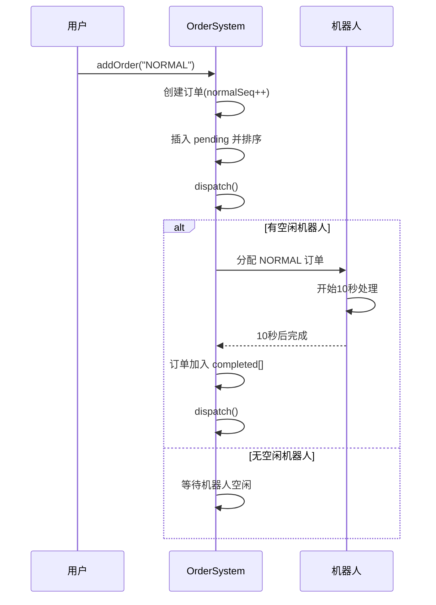
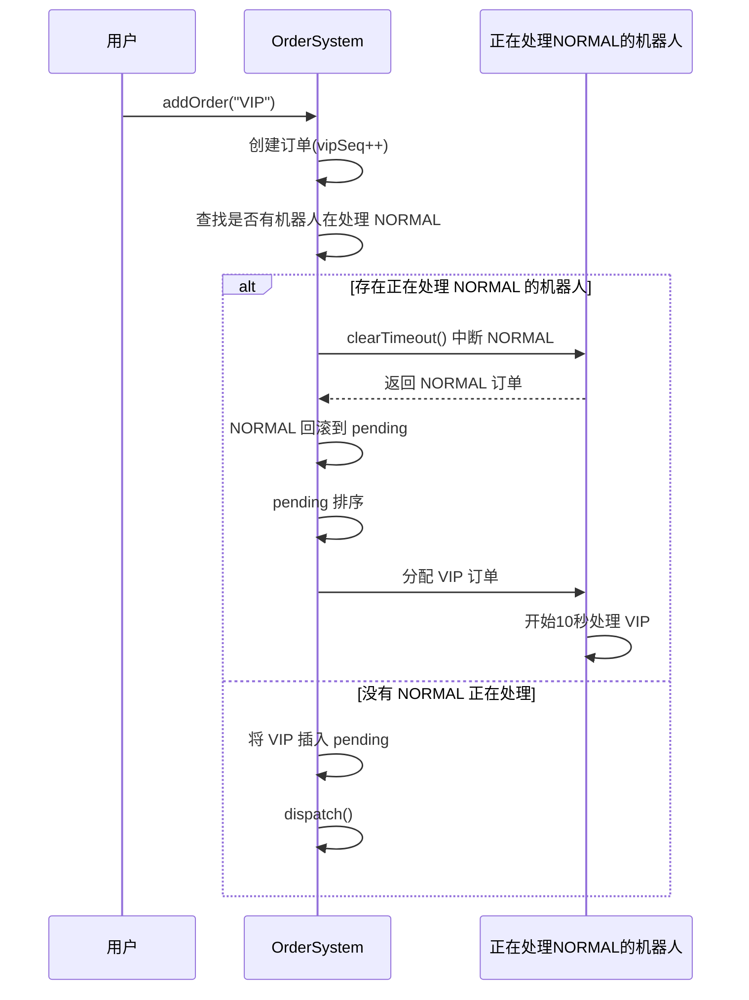
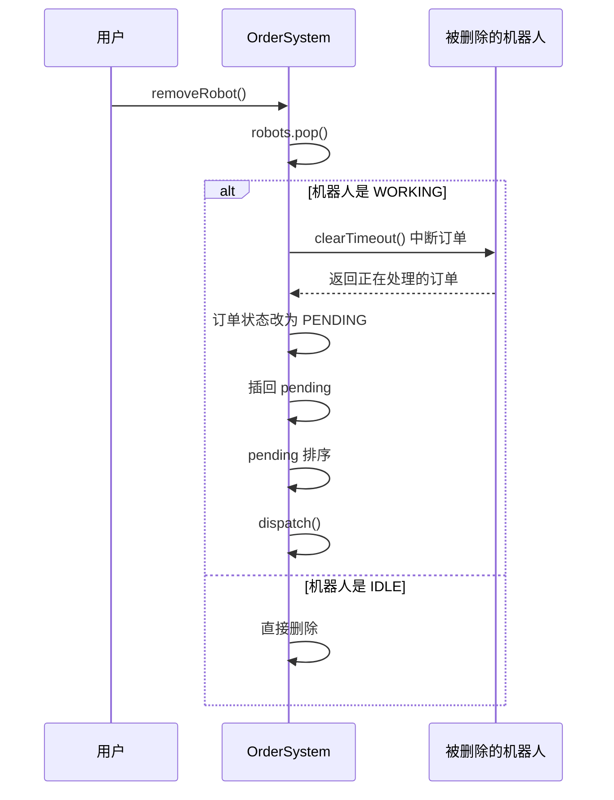
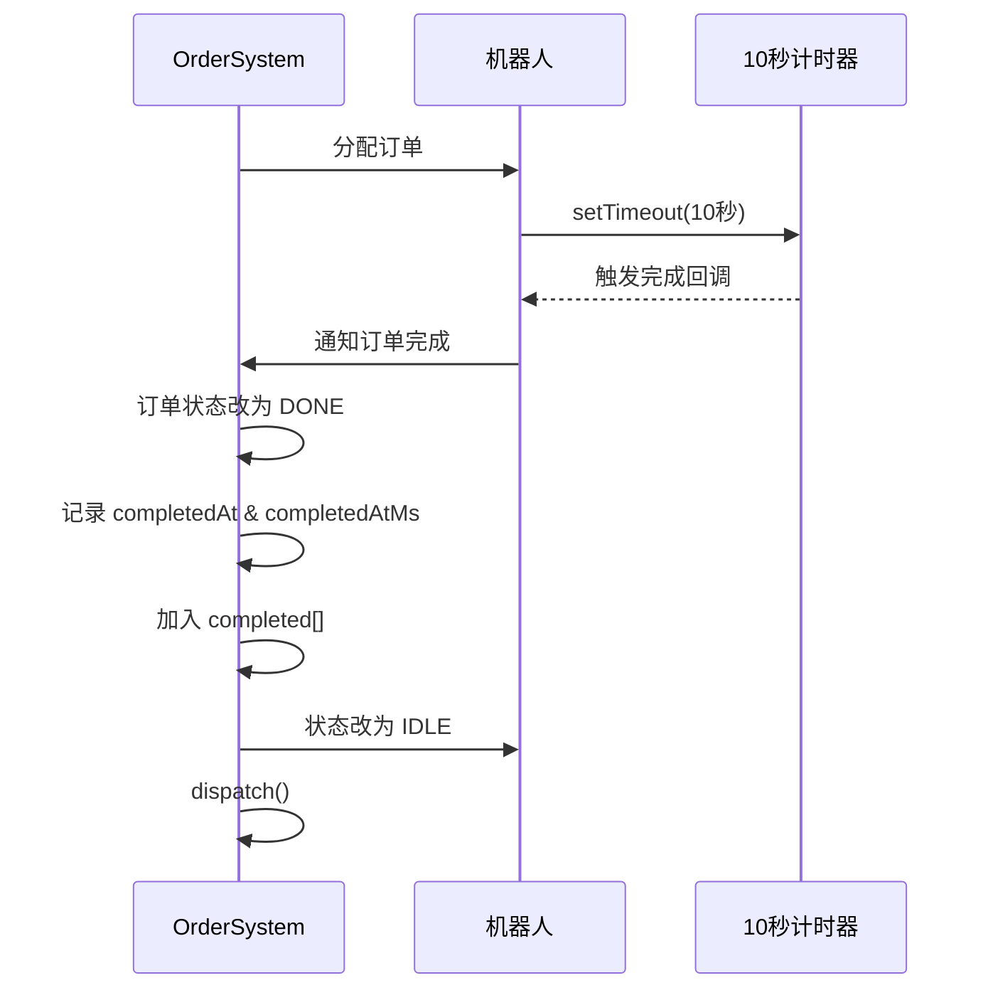
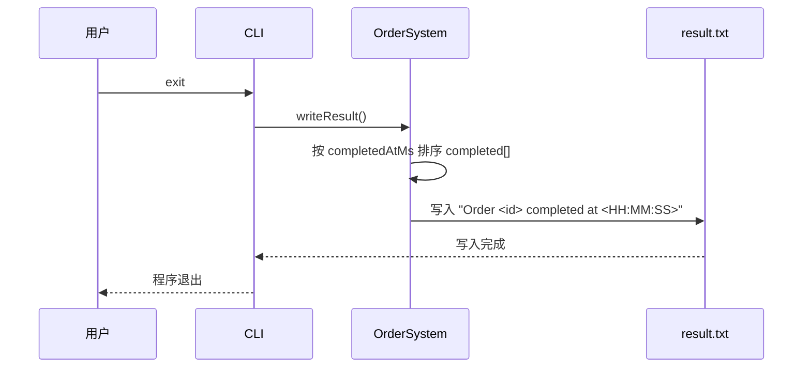

# 麦当劳自动化烹饪机器人订单控制系统 – 时序图

本时序图文档基于当前仓库中的 `OrderSystem.js` 实现，展示系统在关键业务场景下的交互流程，包括：

- 普通订单处理流程
- VIP 抢占 NORMAL 流程
- 删除机器人导致订单回滚流程
- 订单完成流程
- CLI 退出并生成 result.txt

所有流程均与代码行为完全一致。

## 1. 普通订单处理流程（NORMAL）

## 2. VIP 抢占 NORMAL 流程（Preemption）

## 3. 删除机器人导致订单回滚流程（removeRobot）

## 4. 订单完成流程（10秒计时器）

## 5. CLI 退出并生成 result.txt

## 文档与代码一致性声明

本时序图文档完全基于当前仓库中的 `OrderSystem.js`，所有流程均与实际行为一致。