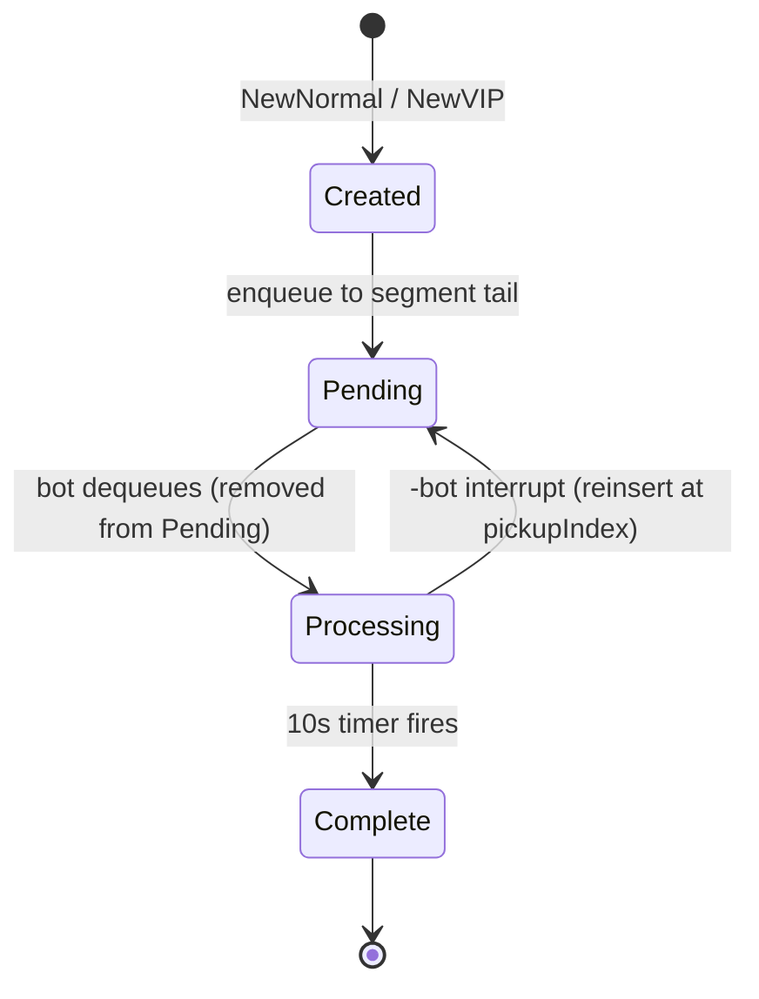
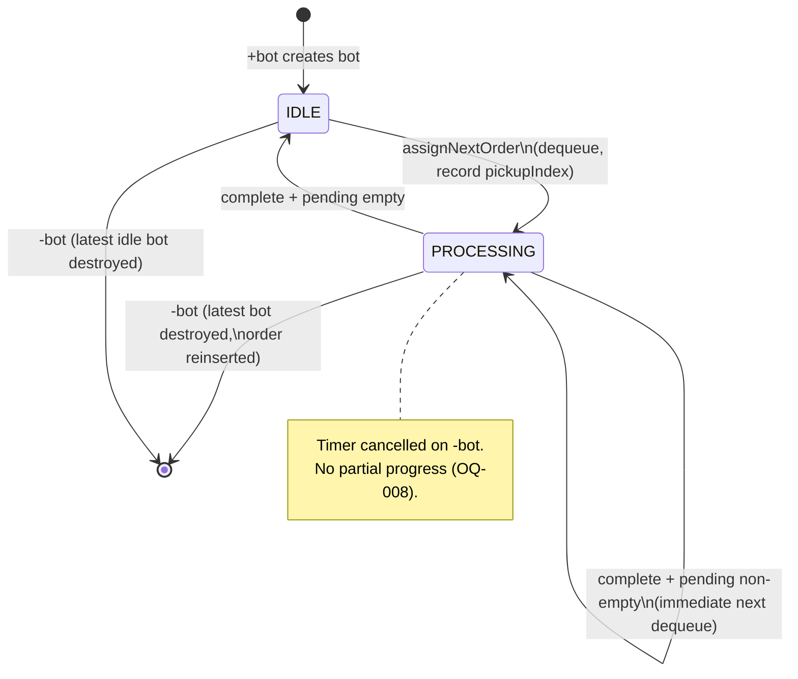

# Technical Design: McDonald's Order Controller (Backend Go CLI)

| Field | Value |
|-------|-------|
| **Version** | v1.0 |
| **Date** | 2026-07-06 |
| **Status** | Draft（待评审） |
| **PRD** | `docs/PRD.md` v1.0 |
| **Go Version** | 1.23.9 |
| **Scope** | Backend CLI path only |

---

## 1. Overview & Goals

### 1.1 Purpose

This document specifies the backend implementation of the McDonald's Order Controller: an in-memory CLI that orchestrates VIP-priority order queues, cooking-bot scheduling (10 seconds per order), and event logging to `scripts/result.txt`.

### 1.2 Scope (In)

| Area | Included |
|------|----------|
| Order creation (Normal / VIP) with global monotonic IDs | ✓ |
| Two-segment pending queue (VIP FIFO + Normal FIFO) | ✓ |
| Bot lifecycle: create (+bot), destroy (-bot LIFO), IDLE / PROCESSING | ✓ |
| 10-second processing timer with full restart on interrupt | ✓ |
| Order reinsertion at `pickupIndex` on bot removal | ✓ |
| Interactive REPL CLI (P1, interview demo) | ✓ |
| Batch/scenario mode for CI via `run.sh` | ✓ |
| Unit tests for queue, scheduler, controller | ✓ |
| `scripts/test.sh`, `build.sh`, `run.sh` integration | ✓ |
| `HH:MM:SS` event logging to `scripts/result.txt` | ✓ |

### 1.3 Non-Goals

- Persistence, authentication, multi-store deployment (PRD §12)
- Frontend UI (separate path)
- Sub-second log precision (milliseconds are P1 optional)
- Production-grade observability (metrics, tracing, health checks)
- External dependencies beyond Go standard library

### 1.4 PRD Traceability

| PRD Section | Design Section |
|-------------|----------------|
| §5 FR-001–FR-008, FR-010–FR-012, FR-015 | §4–§9 |
| §7 Business rules | §3–§5 |
| §8 Bot state machine | §3.3 |
| §9 EC-001–EC-015 | §13 |
| §10.2 Backend CLI | §8–§10 |
| §11 TC-001–TC-012 | §11 |
| §15 OQ-001–OQ-010 | §16 (all defaults adopted) |

### 1.5 Success Criteria

1. All P0 functional requirements satisfied.
2. `./scripts/test.sh` passes in CI.
3. `./scripts/run.sh` produces non-empty `scripts/result.txt` with `HH:MM:SS` timestamps.
4. Interactive CLI demonstrates live command handling for interview.
5. Core domain logic covered by table-driven unit tests (no real-time sleeps in unit tests).

---

## 2. Architecture

### 2.1 Pattern

**Modular monolith with hexagonal (ports & adapters) layering.**

- **Domain** (inner): pure data structures and queue algorithms — no I/O, no time, no goroutines.
- **Application** (`controller`): orchestrates domain + clock + scheduling; owns concurrency boundaries.
- **Adapters** (`cli`, `logging`, `clock`): stdin/stdout, file output, injectable time.

```
┌─────────────────────────────────────────────────────────┐
│  cmd/order-controller/main.go                           │
│  (composition root: wires clock, logger, controller, CLI)│
└──────────────────────────┬──────────────────────────────┘
                           │
         ┌─────────────────┼─────────────────┐
         ▼                 ▼                 ▼
   ┌──────────┐     ┌─────────────┐    ┌───────────┐
   │ cli/     │────▶│ controller/ │◀───│ clock/    │
   │ repl     │     │ (app layer) │    │ real/mock │
   │ batch    │     └──────┬──────┘    └───────────┘
   └──────────┘            │
                           ▼
                    ┌─────────────┐
                    │  domain/    │
                    │ queue, bot  │
                    └─────────────┘
                           ▲
                    ┌─────────────┘
                    │ logging/ (adapter)
                    └─────────────┘
```

### 2.2 Dependency Direction

```
cli → controller → domain
cli → logging
controller → domain, clock, logging
domain → (nothing)
clock → (nothing)
logging → (nothing)
```

**Rule:** `domain` must not import `controller`, `cli`, or `clock`. Tests import all layers.

### 2.3 Package Layout

| Package | Responsibility |
|---------|----------------|
| `internal/domain` | `Order`, `Bot`, `PendingQueue`, `Store` (aggregate state) |
| `internal/clock` | `Clock` interface, real and mock implementations |
| `internal/controller` | `Controller` — command handlers, bot timer scheduling |
| `internal/logging` | `Logger` — formats events with timestamps |
| `internal/cli` | Argument parsing, REPL loop, batch scenario runner |
| `cmd/order-controller` | `main()`, flag/env wiring |

### 2.4 Process Model

Single OS process, single `Controller` instance. All mutable state lives inside `Controller` protected by one `sync.Mutex`. Timer completion and cancellation callbacks acquire the same mutex before mutating state.

No busy polling: when PENDING is empty and all bots are IDLE, the process blocks on stdin (interactive) or exits (batch).

---

## 3. Core Domain Model

### 3.1 Types

```go
// internal/domain/order.go
package domain

type OrderType string

const (
    OrderTypeNormal OrderType = "NORMAL"
    OrderTypeVIP    OrderType = "VIP"
)

type Order struct {
    ID   int
    Type OrderType
}

func NewOrder(id int, t OrderType) Order {
    return Order{ID: id, Type: t}
}
```

```go
// internal/domain/bot.go
package domain

type BotState string

const (
    BotStateIdle       BotState = "IDLE"
    BotStateProcessing BotState = "PROCESSING"
)

type Bot struct {
    ID           int
    State        BotState
    CurrentOrder *Order // nil when IDLE
    PickupIndex  int    // 0-based logical index at dequeue; -1 when IDLE
}

func NewBot(id int) Bot {
    return Bot{ID: id, State: BotStateIdle, PickupIndex: -1}
}
```

```go
// internal/domain/store.go
package domain

type Store struct {
    NextOrderID int
    NextBotID   int
    Pending     PendingQueue
    Complete    []Order // append-only, completion order
    Bots        []Bot   // sorted by ID ascending
}
```

### 3.2 PendingQueue

```go
// internal/domain/queue.go
package domain

type PendingQueue struct {
    VIP    []Order
    Normal []Order
}

// Logical view: VIP segment followed by Normal segment.
func (q PendingQueue) Len() int { return len(q.VIP) + len(q.Normal) }

func (q PendingQueue) Flatten() []Order {
    out := make([]Order, 0, q.Len())
    out = append(out, q.VIP...)
    out = append(out, q.Normal...)
    return out
}

func SplitByType(logical []Order) PendingQueue {
    var q PendingQueue
    for _, o := range logical {
        if o.Type == OrderTypeVIP {
            q.VIP = append(q.VIP, o)
        } else {
            q.Normal = append(q.Normal, o)
        }
    }
    return q
}
```

### 3.3 Domain Invariants

| ID | Invariant |
|----|-----------|
| INV-1 | Order IDs strictly increase; never reused in a process lifetime |
| INV-2 | Bot IDs strictly increase; active bots sorted by ascending ID |
| INV-3 | Logical queue = `VIP[] ++ Normal[]`; all VIP precede all Normal |
| INV-4 | At most one bot holds a given order (order not in PENDING and PROCESSING simultaneously) |
| INV-5 | PROCESSING bot has non-nil `CurrentOrder` and `PickupIndex >= 0` |
| INV-6 | IDLE bot has nil `CurrentOrder` and `PickupIndex == -1` |
| INV-7 | COMPLETE is append-only; never removed in prototype |
| INV-8 | Dequeue always takes logical front (VIP front, else Normal front) |

### 3.4 Order Lifecycle State Machine



### 3.5 Bot Lifecycle State Machine



---

## 4. Pending Queue Design

### 4.1 Enqueue

```go
func (q *PendingQueue) EnqueueNormal(order Order) {
    q.Normal = append(q.Normal, order)
}

func (q *PendingQueue) EnqueueVIP(order Order) {
    q.VIP = append(q.VIP, order)
}
```

**Complexity:** O(1) amortized append.

### 4.2 Dequeue (Bot Pickup)

```go
// DequeueNext removes and returns the logical front order and its pickupIndex.
// Returns (order, pickupIndex, ok).
func (q *PendingQueue) DequeueNext() (Order, int, bool) {
    if len(q.VIP) > 0 {
        order := q.VIP[0]
        q.VIP = q.VIP[1:]
        return order, 0, true // always index 0 in VIP segment = logical 0
    }
    if len(q.Normal) > 0 {
        order := q.Normal[0]
        q.Normal = q.Normal[1:]
        pickupIndex := len(q.VIP) // after pop, VIP len unchanged; was len(VIP) before dequeue from normal
        // Correct pickupIndex at dequeue time = len(VIP segment before dequeue)
        // Since VIP already empty-checked, pickupIndex = 0 when only normal existed
        return order, len(q.VIP), true
    }
    return Order{}, 0, false
}
```

**Correct `pickupIndex` computation (general):**

```go
func (q *PendingQueue) DequeueNext() (Order, int, bool) {
    if len(q.VIP) > 0 {
        order := q.VIP[0]
        q.VIP = q.VIP[1:]
        return order, 0, true
    }
    if len(q.Normal) > 0 {
        idx := len(q.VIP) // VIP segment length = logical offset of Normal front
        order := q.Normal[0]
        q.Normal = q.Normal[1:]
        return order, idx, true
    }
    return Order{}, 0, false
}
```

### 4.3 Reinsert (Bot Removal Interrupt)

Per PRD §7.4 and OQ-001 (exact logical index at pickup time):

```go
func (q *PendingQueue) ReinsertAt(order Order, pickupIndex int) {
    logical := q.Flatten()
    if pickupIndex < 0 {
        pickupIndex = 0
    }
    if pickupIndex > len(logical) {
        pickupIndex = len(logical)
    }
    logical = append(logical[:pickupIndex], append([]Order{order}, logical[pickupIndex:]...)...)
    *q = SplitByType(logical)
}
```

**Pseudocode:**

```
function reinsert(order, pickupIndex):
    logical = flatten(vipSegment, normalSegment)
    clamp pickupIndex to [0, len(logical)]
    logical.insert(pickupIndex, order)
    vipSegment, normalSegment = split_by_type(logical)
```

**Example (TC-006):** Queue `[V3, N1, N2]`, Bot picks V3 at index 0. After 4s, `-bot` → reinsert V3 at index 0 → `[V3, N1, N2]`.

### 4.4 Peek Helpers (for status / tests)

```go
func (q PendingQueue) Front() (Order, bool) { /* read-only dequeue preview */ }
func (q PendingQueue) StringIDs() string    { /* e.g. "V3,N1,N2" for logging */ }
```

---

## 5. Bot Scheduler Design

### 5.1 Recommended Concurrency Model

**Central Controller + `time.AfterFunc` timer callbacks** (see §15 for comparison).

- One `sync.Mutex` guards `Store` and bot timer handles.
- Each PROCESSING bot has at most one active `clock.Timer` / `time.AfterFunc`.
- On `-bot`: stop timer via `Timer.Stop()`, reinsert order, remove bot from slice.
- On completion callback: move order to COMPLETE, call `assignNextOrder` for that bot.

No dedicated goroutine per bot sitting in a loop; only timer goroutines from the runtime.

### 5.2 Controller Structure

```go
// internal/controller/controller.go
package controller

type Controller struct {
    mu      sync.Mutex
    store   domain.Store
    clock   clock.Clock
    log     logging.Logger
    process time.Duration // default 10s; overridden in tests / fast mode

    timers map[int]clock.TimerHandle // botID → cancellable timer
}

func New(c clock.Clock, log logging.Logger, processDuration time.Duration) *Controller
```

```go
// internal/clock/clock.go
package clock

import "time"

type TimerHandle interface {
    Stop() bool
}

type Clock interface {
    Now() time.Time
    AfterFunc(d time.Duration, f func()) TimerHandle
}
```

Real implementation wraps `time.Now` and `time.AfterFunc`. Mock implementation (`internal/clock/mock.go`) uses a manual advance queue for deterministic tests.

### 5.3 assignNextOrder Flow

```go
// Must be called with mu held.
func (c *Controller) assignNextOrder(botID int) {
    bot := c.findBot(botID)
    if bot == nil || bot.State != domain.BotStateIdle {
        return
    }
    order, idx, ok := c.store.Pending.DequeueNext()
    if !ok {
        return
    }
    bot.State = domain.BotStateProcessing
    bot.CurrentOrder = &order
    bot.PickupIndex = idx
    c.log.BotPicked(botID, order)

    c.timers[botID] = c.clock.AfterFunc(c.process, func() {
        c.onProcessingComplete(botID)
    })
}
```

```go
func (c *Controller) onProcessingComplete(botID int) {
    c.mu.Lock()
    defer c.mu.Unlock()
    delete(c.timers, botID)

    bot := c.findBot(botID)
    if bot == nil || bot.State != domain.BotStateProcessing {
        return // bot was removed while processing
    }
    order := *bot.CurrentOrder
    c.store.Complete = append(c.store.Complete, order)
    c.log.BotCompleted(botID, order, c.store.CompleteIDs())

    bot.CurrentOrder = nil
    bot.PickupIndex = -1
    if c.store.Pending.Len() > 0 {
        // remain PROCESSING semantics: immediately pick next
        c.assignNextOrder(botID)
    } else {
        bot.State = domain.BotStateIdle
        c.log.BotIdle(botID)
    }
}
```

### 5.4 Wake Policy (OQ-003)

| Event | Behavior |
|-------|----------|
| `NewNormal` / `NewVIP` | Enqueue; wake **one** IDLE bot with **lowest ID** |
| `+bot` | Create bot; **immediately** `assignNextOrder(newBotID)` |
| Bot completes, pending non-empty | Same bot takes next (no wake needed) |
| Bot completes, pending empty | Bot → IDLE |
| `-bot` on PROCESSING bot | Cancel timer, reinsert at `pickupIndex`, remove bot; **do not** auto-wake others |
| `-bot` on IDLE bot | Remove bot only |

```go
func (c *Controller) wakeOneIdleBot() {
    for i := range c.store.Bots {
        b := &c.store.Bots[i]
        if b.State == domain.BotStateIdle {
            c.assignNextOrder(b.ID)
            return
        }
    }
}
```

### 5.5 Multi-Bot Dequeue Ordering

When two bots are created sequentially via `+bot +bot` while PENDING has orders:

1. First `+bot` → Bot1 IDLE → immediately assigned order at logical front.
2. Second `+bot` → Bot2 IDLE → immediately assigned next logical front.

No race: mutations happen under mutex on the calling goroutine (CLI command thread). Timer callbacks also take mutex. **Bot ID ascending tie-break is naturally satisfied** because assignments happen serially in command order.

---

## 6. Controller / Orchestrator

### 6.1 Public API (Application Commands)

All methods are synchronous from the caller's perspective (they return after state update; processing continues via timers).

```go
func (c *Controller) CreateNormalOrder() (domain.Order, error)
func (c *Controller) CreateVIPOrder() (domain.Order, error)
func (c *Controller) AddBot() (domain.Bot, error)
func (c *Controller) RemoveBot() error          // returns errNoBot if empty
func (c *Controller) Status() domain.StoreSnapshot
func (c *Controller) Shutdown()                  // stop all timers (batch mode exit)
```

```go
// Read-only snapshot for status command and tests
type StoreSnapshot struct {
    Pending  domain.PendingQueue
    Complete []domain.Order
    Bots     []domain.Bot
}
```

### 6.2 Command → Domain Mapping

| CLI Command | Controller Method | Domain Effects |
|-------------|-------------------|----------------|
| `normal` / `n` | `CreateNormalOrder()` | `NextOrderID++`, append Normal, log, `wakeOneIdleBot()` |
| `vip` / `v` | `CreateVIPOrder()` | `NextOrderID++`, append VIP, log, `wakeOneIdleBot()` |
| `+bot` / `addbot` | `AddBot()` | `NextBotID++`, append Bot IDLE, log, `assignNextOrder(newID)` |
| `-bot` / `removebot` | `RemoveBot()` | Remove max-ID bot; cancel timer if processing; reinsert or idle remove |
| `status` / `s` | `Status()` | No mutation |
| `quit` / `q` | `Shutdown()` | Cancel timers, exit CLI |

### 6.3 RemoveBot Detail

```go
func (c *Controller) RemoveBot() error {
    c.mu.Lock()
    defer c.mu.Unlock()
    if len(c.store.Bots) == 0 {
        c.log.Warn("no bot to remove")
        return ErrNoBot
    }
    idx := len(c.store.Bots) - 1 // latest = max ID
    bot := c.store.Bots[idx]

    if bot.State == domain.BotStateProcessing {
        if t, ok := c.timers[bot.ID]; ok {
            t.Stop()
            delete(c.timers, bot.ID)
        }
        order := *bot.CurrentOrder
        c.store.Pending.ReinsertAt(order, bot.PickupIndex)
        c.log.BotInterrupted(bot.ID, order, bot.PickupIndex)
    }
    c.log.BotRemoved(bot.ID)
    c.store.Bots = append(c.store.Bots[:idx], c.store.Bots[idx+1:]...)
    return nil
}
```

### 6.4 Event Logging Hooks

Every state transition emits a log line via `logging.Logger` (see §9). Controller never writes files directly.

---

## 7. Time Abstraction

### 7.1 Clock Interface

Defined in §5.2. Enables:

- **Production / interactive:** real wall clock, 10s processing.
- **Unit tests:** mock clock — manual `Advance(d)` fires due timers deterministically.
- **CI `run.sh`:** real clock with `--process-duration=100ms` **or** mock scenario driver with scripted time (preferred for speed).

### 7.2 Processing Duration Configuration

| Mode | Duration | Mechanism |
|------|----------|-----------|
| Interactive default | `10s` | `-process-duration=10s` (default) |
| CI batch (`run.sh`) | `100ms` | env `ORDER_PROCESS_DURATION=100ms` or flag |
| Unit tests | arbitrary | inject via `New(..., 50*time.Millisecond)` + mock clock |

PRD NFR-003 allows ±100ms system error; 100ms in CI is acceptable for functional validation. Timestamps in `result.txt` still use real `HH:MM:SS` from `clock.Now()`.

### 7.3 Mock Clock Sketch

```go
type MockClock struct {
    mu      sync.Mutex
    now     time.Time
    timers  []*mockTimer // sorted by fire time
}

func (m *MockClock) Advance(d time.Duration) {
    // fire all timers with deadline <= now+d
}
```

Tests never call `time.Sleep`.

---

## 8. CLI Layer

### 8.1 Run Modes

| Mode | Trigger | Behavior |
|------|---------|----------|
| **Batch / CI** | `run.sh` passes `--batch scripts/scenarios/ci.txt` | Execute commands from file, wait for pending timers, write log to stdout → redirected to `result.txt` |
| **Interactive REPL** | No args, or `--interactive` | Read stdin line-by-line until `quit` |
| **Stdin pipe** | `--batch -` | Read commands from stdin (optional convenience) |

### 8.2 Entry Point

```go
// cmd/order-controller/main.go
func main() {
    fs := flag.NewFlagSet("order-controller", flag.ExitOnError)
    batch := fs.String("batch", "", "path to command script")
    interactive := fs.Bool("interactive", false, "force REPL mode")
    processDur := fs.Duration("process-duration", 10*time.Second, "order processing duration")
    fs.Parse(os.Args[1:])

    clk := clock.Real{}
    logger := logging.New(os.Stdout, clk)
    ctrl := controller.New(clk, logger, *processDur)

    if *batch != "" {
        cli.RunBatch(ctrl, *batch)
    } else if *interactive || terminal.IsTerminal(int(os.Stdin.Fd())) {
        cli.RunREPL(ctrl, os.Stdin, os.Stdout)
    } else {
        cli.RunBatchReader(ctrl, os.Stdin)
    }
    ctrl.Shutdown()
}
```

Use `golang.org/x/term` **only if needed**; otherwise default to REPL when stdin is a TTY via a tiny local helper (`isatty`) to stay stdlib-only. Alternative: always require explicit `--interactive` or `--batch` flag (simplest, zero deps).

**Recommendation:** explicit flags only (`--batch` or `--interactive`) — no extra dependency.

### 8.3 Command Parser

```go
// internal/cli/parser.go
type Command int

const (
    CmdNormal Command = iota
    CmdVIP
    CmdAddBot
    CmdRemoveBot
    CmdStatus
    CmdQuit
    CmdWait   // test/batch helper: "wait 10s" — optional for batch scripts
    CmdUnknown
)

func Parse(line string) (Command, error)
```

| Input | Aliases | Normalized |
|-------|---------|------------|
| `normal` | `n` | `CmdNormal` |
| `vip` | `v` | `CmdVIP` |
| `+bot` | `addbot` | `CmdAddBot` |
| `-bot` | `removebot` | `CmdRemoveBot` |
| `status` | `s` | `CmdStatus` |
| `quit` | `q` | `CmdQuit` |

Parsing: `strings.ToLower(strings.TrimSpace(line))`.

### 8.4 Batch Scenario for CI

`scripts/scenarios/ci.txt`:

```
normal
+bot
wait 200ms
status
quit
```

Batch runner executes commands, and after each line drains mock/fast timers until idle or calls `time.Sleep` only in batch mode when using real clock with short duration.

**Batch wait strategy (CI):** use `--process-duration=100ms`; after `+bot`, batch runner calls `ctrl.WaitUntilIdle(timeout)` which blocks on a `sync.Cond` signaled when all bots IDLE and pending empty (or use polling with 10ms sleep in adapter only — acceptable in CLI layer, not in domain).

```go
func (c *Controller) WaitUntilIdle(timeout time.Duration) error
```

---

## 9. Logging & result.txt

### 9.1 Format

Each event: `{HH:MM:SS} {EVENT} {key=value ...}`

- **Time format:** `15:04:05` in **local timezone** (OQ-006), zero-padded 24h.
- **Same-second events:** allowed (OQ-009); order preserved by sequence in file.

### 9.2 Event Catalog

| Event | Example Line |
|-------|--------------|
| System start | `09:00:00 SYSTEM started` |
| Order created | `09:00:01 ORDER created id=1 type=NORMAL pending=[1]` |
| Bot created | `09:00:02 BOT created id=1` |
| Bot picked | `09:00:02 BOT id=1 picked order id=1 pickupIndex=0` |
| Bot completed | `09:00:12 BOT id=1 completed order id=1 complete=[1]` |
| Bot idle | `09:00:12 BOT id=1 idle` |
| Bot interrupted | `09:00:05 BOT id=1 interrupted order id=3 reinserted at index=0 pending=[3,1,2]` |
| Bot removed | `09:00:05 BOT removed id=1` |
| Warning | `09:00:06 WARN no bot to remove` |
| Status | `09:00:07 STATUS bots=1:IDLE pending=[] complete=[1,2]` |

### 9.3 Logger Interface

```go
// internal/logging/logger.go
type Logger interface {
    SystemStarted()
    OrderCreated(order domain.Order, pending domain.PendingQueue)
    BotCreated(id int)
    BotPicked(botID int, order domain.Order)
    BotCompleted(botID int, order domain.Order, complete []int)
    BotIdle(botID int)
    BotInterrupted(botID, order domain.Order, pickupIndex int, pending domain.PendingQueue)
    BotRemoved(botID int)
    StatusSnapshot(snap domain.StoreSnapshot)
    Warn(msg string)
}
```

Implementation writes to `io.Writer` with timestamp prefix from injected `Clock.Now()`.

### 9.4 result.txt Generation

`scripts/run.sh`:

```bash
#!/bin/bash
set -euo pipefail
PROCESS_DURATION="${ORDER_PROCESS_DURATION:-100ms}"
./bin/order-controller \
  --batch scripts/scenarios/ci.txt \
  --process-duration="${PROCESS_DURATION}" \
  > scripts/result.txt
```

Ensures file is non-empty with valid timestamps for CI regex check.

---

## 10. Scripts & Build

### 10.1 test.sh

```bash
#!/bin/bash
set -euo pipefail
cd "$(dirname "$0")/.."
go test ./... -race -count=1
```

- Runs all unit tests with race detector.
- No integration sleep; mock clock only in tests.

### 10.2 build.sh

```bash
#!/bin/bash
set -euo pipefail
cd "$(dirname "$0")/.."
mkdir -p bin
go build -o bin/order-controller ./cmd/order-controller
```

### 10.3 run.sh

Responsibilities:

1. Ensure binary exists (call `build.sh` or assume CI build step ran first — CI runs build then run separately).
2. Execute batch scenario with accelerated processing.
3. Redirect stdout → `scripts/result.txt` (truncate/create).

### 10.4 go.mod

```
module github.com/lijian-bj/se-take-home-assignment

go 1.23.9
```

No third-party modules required.

---

## 11. Testing Strategy

### 11.1 Test Layers

| Layer | Package | Focus |
|-------|---------|-------|
| Unit | `internal/domain` | Queue enqueue/dequeue/reinsert, invariants |
| Unit | `internal/controller` | Scheduling, bot lifecycle, EC cases (mock clock) |
| Unit | `internal/cli` | Command parsing |
| Integration | `scripts/run.sh` (CI) | End-to-end binary, result.txt format |

### 11.2 PRD Test Case Mapping

| TC | Test Name | Package | Key Assertions |
|----|-----------|---------|----------------|
| TC-001 | `TestSingleBotSingleOrder` | controller | After advance 10s: complete=[1], pending empty, bot IDLE |
| TC-002 | `TestVIPPreemptsNormal` | controller | Normal #1 queued, VIP #2 created, bot processes #2 before #1 |
| TC-003 | `TestDualVIPFIFO` | controller | VIP #1 then #2 → processing order 1 then 2 |
| TC-004 | `TestAddBotConsumesPending` | controller | Pending [#1,#2], +bot → bot processing #1 immediately |
| TC-005 | `TestRemoveIdleBot` | controller | 2 IDLE bots, -bot → remaining bot ID=1 |
| TC-006 | `TestRemoveProcessingBotReinsert` | controller | Pickup V3 from [V3,N1,N2], advance 4s, -bot → pending restored, complete empty |
| TC-007 | `TestReprocessAfterReinsert` | controller | After TC-006 state, +bot, advance 10s → complete has #3 |
| TC-008 | `TestDualBotConcurrentPickup` | controller | [V1,N2,N3], +bot,+bot → B1→V1, B2→N2, pending [N3] |
| TC-009 | `TestRemoveLatestDoesNotAffectOther` | controller | B1→#1, B2→#2, -bot → B1 still processing #1, #2 reinserted |
| TC-010 | `TestOrderIDMonotonic` | controller | Create #1,#2,VIP #3 → id=3 |
| TC-011 | `TestFirstOrderIDIsOne` | controller | First order id == 1 |
| TC-012 | `TestCIResultFormat` | integration | Shell: run.sh → result.txt matches timestamp regex |

### 11.3 Domain Queue Table Tests

```go
func TestPendingQueue_ReinsertAt(t *testing.T) {
    tests := []struct {
        name       string
        initial    domain.PendingQueue
        order      domain.Order
        index      int
        wantVIP    []int
        wantNormal []int
    }{
        {"front", ...},
        {"middle", ...},
        {"tail", ...},
    }
    // ...
}
```

### 11.4 Controller Test Pattern

```go
func TestVIPPreemptsNormal(t *testing.T) {
    clk := clock.NewMock(time.Date(2026, 7, 6, 9, 0, 0, 0, time.Local))
    log := logging.NewDiscard()
    c := controller.New(clk, log, 10*time.Second)

    c.CreateNormalOrder() // #1
    c.CreateVIPOrder()    // #2
    c.AddBot()
    // assert bot processing order 2
    clk.Advance(10 * time.Second)
    // assert complete [#2], then wakes to process #1
}
```

### 11.5 Race Detection

`go test -race ./...` in `test.sh` validates mutex coverage on shared `Controller` state.

---

## 12. Concurrency & Thread Safety

### 12.1 Mutex Boundaries

| Resource | Protection |
|----------|------------|
| `Controller.store` | `Controller.mu` |
| `Controller.timers` | same mutex |
| Mock clock internal heap | `MockClock.mu` (separate) |

**All public `Controller` methods** acquire `mu` at entry (except `WaitUntilIdle` which uses `Cond` with same mutex).

### 12.2 Timer Callback Safety

`onProcessingComplete` and timer stop during `RemoveBot`:

1. Always lock `mu` at start of callback.
2. If bot removed, timer stopped, or state changed → no-op completion.
3. `Timer.Stop()` return value ignored for prototype; idempotent completion guard sufficient.

### 12.3 Race Scenarios Prevented

| Scenario | Prevention |
|----------|------------|
| Double dequeue of same order | Single mutex; dequeue only in `assignNextOrder` |
| Complete after `-bot` | Completion checks bot still PROCESSING with same order |
| Concurrent CLI commands | REPL is single-threaded; batch is sequential |
| Timer vs RemoveBot | RemoveBot stops timer before mutating bot list |

### 12.4 Happens-Before Relationships

```
Command thread: Lock → mutate → assign timer → Unlock
Timer thread:   Lock → complete → maybe assign next → Unlock
```

No lock ordering with external resources.

---

## 13. Error Handling

| ID | Scenario | Handling |
|----|----------|----------|
| EC-001 | Order created, pending empty, IDLE bot exists | Enqueue + `wakeOneIdleBot()` → immediate pickup |
| EC-002 | Order created, no bots | Enqueue only; log pending state |
| EC-003 | `-bot` with zero bots | Return `ErrNoBot`; log `WARN no bot to remove`; no panic |
| EC-004 | `-bot` while only bot processing | Timer cancelled, order reinserted, bots empty |
| EC-005 | `-bot` latest IDLE, others processing | Remove only latest; others unchanged |
| EC-006 | `-bot` latest PROCESSING, others processing | Latest interrupted + reinsert; others continue |
| EC-007 | After reinsert at front | Next `+bot` or `wakeOneIdleBot` takes logical front (may be reinserted order) |
| EC-008 | VIP interrupted, new VIP arrives | Reinsert at fixed `pickupIndex`; new VIP appends to VIP segment — relative order depends on index (per OQ-001) |
| EC-009 | Rapid order creation | Mutex serializes; IDs monotonic; queue consistent |
| EC-010 | Rapid `+bot` | Each addition assigns if pending available; no double assignment |
| EC-011 | `-bot` mid-timer | Timer stopped; order never reaches COMPLETE |
| EC-012 | All bots busy, new order | Enqueue only; no preemption of in-flight orders |
| EC-013 | Fresh process | `NextOrderID` and `NextBotID` start at 1 |
| EC-014 | Midnight rollover | Time format remains `HH:MM:SS` without date |
| EC-015 | N/A (backend) | — |

### 13.1 Error Types

```go
var (
    ErrNoBot = errors.New("no bot to remove")
)
```

CLI prints human-readable message to stderr; logs WARN to stdout/file.

Unknown commands in REPL: print help hint, continue loop (no exit).

---

## 14. File / Directory Structure

```
.
├── go.mod
├── go.sum                          # empty unless deps added
├── cmd/
│   └── order-controller/
│       └── main.go                 # entry, flags, wiring
├── internal/
│   ├── domain/
│   │   ├── order.go
│   │   ├── bot.go
│   │   ├── queue.go
│   │   ├── queue_test.go
│   │   └── store.go
│   ├── clock/
│   │   ├── clock.go                # interface
│   │   ├── real.go
│   │   └── mock.go
│   ├── logging/
│   │   ├── logger.go
│   │   └── format.go
│   ├── controller/
│   │   ├── controller.go
│   │   ├── controller_test.go
│   │   └── errors.go
│   └── cli/
│       ├── parser.go
│       ├── parser_test.go
│       ├── repl.go
│       └── batch.go
├── scripts/
│   ├── test.sh
│   ├── build.sh
│   ├── run.sh
│   ├── result.txt                  # generated (gitignored or committed placeholder)
│   └── scenarios/
│       └── ci.txt
├── docs/
│   ├── PRD.md
│   └── superpowers/specs/
│       └── 2026-07-06-order-controller-backend-design.md  # this document
└── .github/workflows/
    └── backend-verify-result.yaml
```

### 14.1 .gitignore Additions

```
/bin/
/scripts/result.txt   # optional: commit sample for local dev only
```

---

## 15. Design Decisions & Trade-offs

### 15.1 Scheduler Approaches Compared

| Criterion | A. Goroutine-per-Bot | B. Central Dispatcher + Timers | C. Tick-Based Polling |
|-----------|---------------------|--------------------------------|----------------------|
| **Model** | Each bot runs `for { select { case <-assign: ... case <-timer: ... } }` | Single mutex; `AfterFunc` per active bot | 100ms tick scans all bots |
| **Idle CPU** | Blocked on channel — good | No timers when idle — good | Constant wakeups — **bad** |
| **Correctness** | Channel races need careful design | Serialized mutations — **easier** | Edge cases at tick boundaries |
| **Timer cancel** | Per-bot cancel channel | `Timer.Stop()` — **simple** | Must track elapsed manually |
| **Testability** | Must sync many goroutines | Mock clock + advance — **easy** | Flaky timing |
| **Code size** | ~200 LOC scheduler | ~150 LOC scheduler | ~100 LOC but wrong semantics |
| **PRD NFR event-driven** | ✓ | ✓ | ✗ |

### 15.2 Recommendation

**Choose B: Central Dispatcher with `Clock.AfterFunc` callbacks.**

Rationale: smallest correct implementation for a 1-hour prototype; natural fit for injectable mock clock; obeys "no busy polling"; `-bot` timer cancellation maps directly to `Timer.Stop()`.

Goroutine-per-bot (A) is viable but adds channel plumbing without benefit at ≤10 bots. Tick-based (C) violates NFR and is rejected.

### 15.3 Other Decisions

| Decision | Choice | Rationale |
|----------|--------|-----------|
| Two-segment queue vs single sorted list | Two segments | O(1) enqueue matches PRD §7.2 |
| Stdlib only | Yes | Assignment scope; no framework overhead |
| Fast CI duration | 100ms flag | CI wall time << 10s × orders |
| Explicit CLI flags | `--batch` / `--interactive` | Avoid TTY detection dependency |
| Processing bot stays in PROCESSING across chained orders | Yes | Matches PRD state machine "PROCESSING → PROCESSING" |

---

## 16. Open Questions Resolution

All PRD §15 suggested defaults are **adopted**.

| ID | Question | Decision | Implementation Impact |
|----|----------|----------|----------------------|
| **OQ-001** | Original position semantics | **Exact logical queue index at pickup (`pickupIndex`)** | `DequeueNext` returns index; `ReinsertAt` flatten/split |
| **OQ-002** | PENDING includes in-flight orders? | **No** — processing orders excluded from pending view | `Status()` shows `Pending` only; log reflects dequeue |
| **OQ-003** | Wake all IDLE bots or one on new order? | **Wake one** — lowest bot ID; `+bot` assigns new bot directly | `wakeOneIdleBot()`; `AddBot` calls `assignNextOrder` |
| **OQ-004** | COMPLETE sort order | **Completion time append order** | `store.Complete = append(...)` |
| **OQ-005** | IDs start at 1? | **Yes** | `NextOrderID` and `NextBotID` init to 1, pre-increment or post-increment consistently |
| **OQ-006** | Timezone | **Local** | `time.Now().Format("15:04:05")` in local TZ |
| **OQ-007** | run.sh input mode | **Fixed batch scenario** for CI; REPL for local/interview | `scripts/scenarios/ci.txt`; `--interactive` flag |
| **OQ-008** | Partial progress on `-bot`? | **No — full 10s restart** | Cancel timer; reinsert; no fractional state |
| **OQ-009** | Same-second timestamps | **Allowed** | No millisecond field required |
| **OQ-010** | Frontend 10s wait | **N/A (backend)** — backend uses real 10s interactive, accelerated in CI/tests | `--process-duration` flag |

---

## Appendix A: Implementation Checklist

1. [ ] Initialize Go module and directory structure (§14)
2. [ ] Implement `domain` queue with tests (§4, §11.3)
3. [ ] Implement `clock` real + mock (§7)
4. [ ] Implement `logging` (§9)
5. [ ] Implement `controller` with TC-001–TC-011 tests (§5, §11.2)
6. [ ] Implement `cli` parser, REPL, batch runner (§8)
7. [ ] Wire `cmd/order-controller/main.go` (§8.2)
8. [ ] Update `scripts/*.sh` (§10)
9. [ ] Add `scripts/scenarios/ci.txt`
10. [ ] Verify CI workflow locally: `test.sh && build.sh && run.sh`

---

## Appendix B: Sample CI Scenario Trace

**Script (`ci.txt`):** `normal`, `vip`, `+bot`, `+bot`, `wait`, `-bot`, `status`, `quit`

**Expected highlights (100ms process duration):**

- VIP #2 dequeued before Normal #1
- Bot1 → order 2, Bot2 → order 1 concurrently
- `-bot` removes highest ID bot; interrupted order reinserted at recorded index
- `result.txt` contains multiple `HH:MM:SS` lines

---

*End of document — v1.0*
